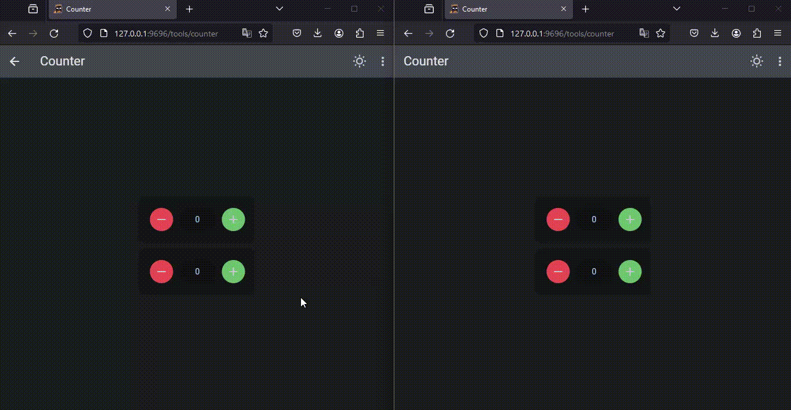
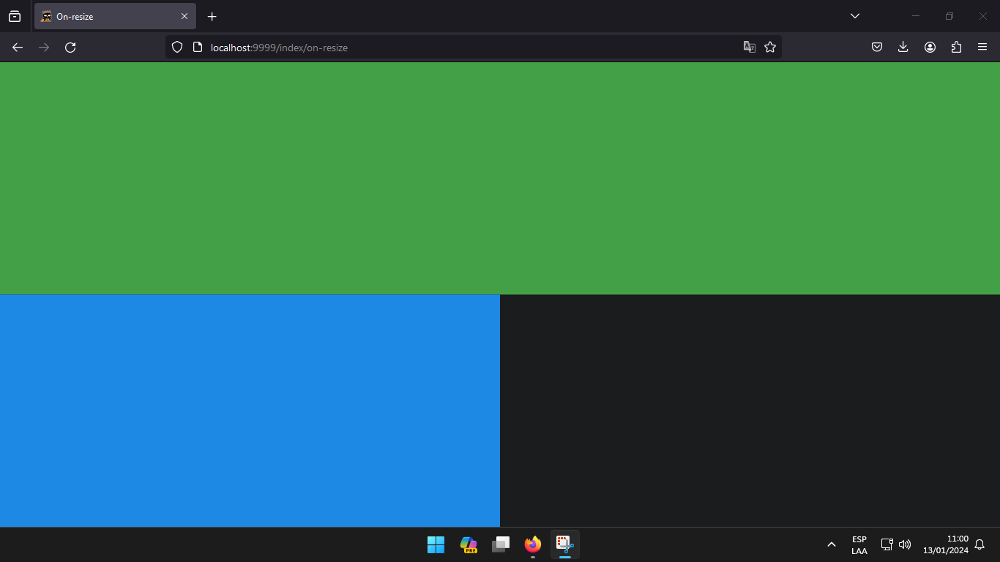
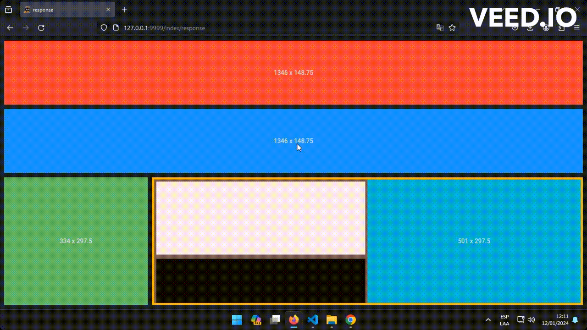
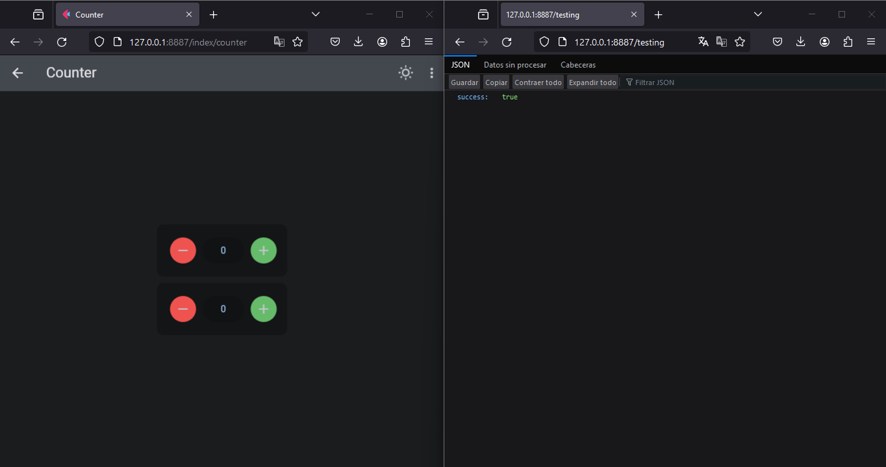

[](https://github.com/Daxexs)[](https://pypi.org/project/flet-easy)

[](https://pdm-project.org)

<div style="text-align:center">
    
</div>


# 🔥Flet-Easy
`Flet-Easy` is a package built as an add-on for [`Flet`](https://github.com/flet-dev/flet), designed for beginners what it does is to make `Flet` easier when building your apps, with a tidier and simpler code. Some functions:

* Facilitates the handling of flet events.
* Page building using decorators, which allows you to make numerous custom configurations to flet for desktop, mobile and website application.
* Designed to work with numerous pages of your created application.
* Provides better MVC construction of your code, which can be scalable and easy to read.
* Not only limits the MVC model but you can customize it according to your preferences.
* Customized URLs for more precision in sending data.
* Support asynchronous.
* Supports Application Packaging for distribution.

## 📌Flet events it handles

- `on_route_change` :  Dynamic routing
- `on_view_pop`
- `on_keyboard_event`
- `on_resize`
- `on_error`

## 📌Form of use:
- Installation [view](#Installation)
- Flet-Easy app example [view](#Flet-Easy-app-example)
- How to use Flet-Easy? [view](#-How-to-use-Flet-Easy)
- How to create a new page? [view](#-How-to-create-a-new-page)
- Using dynamic routes [view](#-Using-Dynamic-Routes)
- Add pages from other files to the main application. [view](#-add-pages-from-other-files-to-the-main-application)
- Adding pages to the main app without using decorators [view](#-Adding-pages-to-the-main-app-without-using-decorators)
- Customized app configuration [view](#-Customized-app-configuration)
  - Route protection [view](#-Route-protection)
  - Add general settings in the app. [view](#%EF%B8%8F-add-general-settings-in-the-app)
  - Add settings of the View controller of Flet [view](#-Add-settings-of-the-View-controller-of-Flet)
  - Add a custom page, which will be activated when a page (path) is not found. [view](#%EF%B8%8F-add-a-custom-page-which-will-be-activated-when-a-page-path-is-not-found)
  - Configure custom events [view](#-configure-custom-events)
- Events configured by Flet-Easy. [view](#-events-configured-by-flet-easy)
  - Use on_keyboard_event [view](#%EF%B8%8F-use-on_keyboard_event)
  - Use on_resize [view](#%EF%B8%8F-use-on_resize)
- Class ResponsiveControlsy [view](#-Class-ResponsiveControlsy)
- Run the app [view](#-Run-the-app)
- Working with other apps and creating apis [view](-working-with-other-apps-and-creating-apis)
- Code examples [view](-code-examples)


## 💻Installation:
Requires installation for use:
* Flet (Installed automatically)
* Flet-fastapi (Optional)
* uvicorn (Optional)
```bash
  pip install flet-easy
```

## 💻Update:
```bash
  pip install flet-easy --upgrade
```

## 🔥Flet-Easy app example
Here is an example of an application with 2 pages, "Home" and "Counter":

```python
import flet as ft
import flet_easy as fs

app = fs.FletEasy(route_init="/flet-easy")

# We add a page
@app.page(route="/flet-easy")
def index_page(data: fs.Datasy):
    page = data.page

    page.title = "Flet-Easy"

    def go_counter(e):
        page.go("/counter")

    return ft.View(
        route="/flet-easy",
        controls=[
            ft.Text("Home page"),
            ft.FilledButton("Go to Counter", on_click=go_counter),
        ],
        vertical_alignment=ft.MainAxisAlignment.CENTER,
        horizontal_alignment=ft.CrossAxisAlignment.CENTER,
    )

# We add a second page
@app.page(route="/counter")
def counter_page(data: fs.Datasy):
    page = data.page

    page.title = "Counter"

    txt_number = ft.TextField(value="0", text_align="right", width=100)

    def minus_click(e):
        txt_number.value = str(int(txt_number.value) - 1)
        page.update()

    def plus_click(e):
        txt_number.value = str(int(txt_number.value) + 1)
        page.update()

    def go_home(e):
        page.go("/flet-easy")

    return ft.View(
        route="/counter",
        controls=[
            ft.Row(
                [
                    ft.IconButton(ft.icons.REMOVE, on_click=minus_click),
                    txt_number,
                    ft.IconButton(ft.icons.ADD, on_click=plus_click),
                ],
                alignment="center",
            ),
            ft.FilledButton("Go to Home", on_click=go_home),
        ],
        vertical_alignment=ft.MainAxisAlignment.CENTER,
        horizontal_alignment=ft.CrossAxisAlignment.CENTER,
    )

# We run the application
app.run()
```

## 🚀 How to use `Flet-Easy`?
Flet-Easy` presents a structure according to how the user wants to adapt it, since it allows to have several files and connect them to a main file.

* To use `Flet-easy`, first you have to use the `FletEasy` class and create an object where you can make the app configurations.
we create the app object, in it you can configure:

    * `route_prefix` : The path that is different from '/'.
    * `route_init` : The initial path when initializing the app
    * `route_login` : The path that will be redirected when the app has path protection configured.
    * `on_Keyboard` : Activate the event on_Keyboard, by default it is deactivated (False).
    * `on_resize` : Activate the event on_resize, by default it is deactivated (False).
  
Example:
```Python
import flet_easy as fs

app = fs.FletEasy(
    route_prefix='/hi',
    route_init='/hi',
    route_login='/hi/login',
)
```

## 🚀 How to create a new page?
To create a new page a decorator that offers the object created by the `FletEasy` class, which is `page` that allows to enter certain parameters, is used.

* `route` : text string of the url, for example('/FletEasy').
* `clear` :  Removes the pages from the page.views list of flet. (optional)
* `protected_route` : Protects the route of the page, according to the configuration of the login decorator of the FletEasy class. (optional)
* `custom_params` : To add parameter validation in the custom url using a dictionary, where the key is the name of the parameter validation and the value is the custom function that should return a value (boolean if false). [view](#-using-dynamic-routes)

Example:
```Python
@app.page(route="/home")
def home_page(data: fs.Datasy):
    page = data.page
    page.title = "Flet-Easy"

    return ft.View(
        route="/flet-easy",
        controls=[
            ft.Text("Home page"),
        ],
        vertical_alignment=ft.MainAxisAlignment.CENTER,
        horizontal_alignment=ft.CrossAxisAlignment.CENTER,
    )
```
The decorated function will always receive a parameter which is `data` (can be any name), which will make an object of type `Datasy` of `Flet-Easy`.
This class has the following attributes, in order to access its data:

* `page` : We get the values of the page provided by `Flet` (https://flet.dev/docs/controls/page) .
* `url_params` : We obtain a dictionary with the values passed through the url.
* `view` : Get a `View` object from `Flet` (https://flet.dev/docs/controls/view), previously configured with the `view` decorator of `Flet-Easy`.
* `route_prefix` : Value entered in the `FletEasy` class parameters to create the app object.
* `route_init` : Value entered in the `FletEasy` class parameters to create the app object.
* `route_login` : Value entered in the `FletEasy` class parameters to create the app object.
* `on_keyboard_event` : Get event values to use in the page.
* `on_resize` : Get event values to use in the page.
* `logaut | logaut_async` : Method to close sessions of all sections in the browser (client storage), requires as parameter the key or the control (the parameter key of the control must have the value to delete), this is to avoid creating an extra function.
* `update_login | update_login_async` : Method to create sessions of all sections in the browser (client storage), requires as parameters the key and the value, the same used in the `page.client_storage.set` method.
* `go | go_async` : Method to change the path of the application, in order to reduce the code, you must assign the value of the `key` parameter of the `control` used, for example buttons.

#### 🔃 logaut and update_login
Compatible with android, ios, windows and web.

#### 🎬 Mode:



## ⚡ Using dynamic routes
* **Simple form:** Obtain the values of the parameters of the url, by means of the parameter data of the function.
  
```python
@app.page(route="/test/{id}/user/{name}")
def home_page(data: fs.Datasy, id, name):
    page = data.page
    page.title = "Flet-Easy"
    
    # Another way to obtain the values
    params = data.url_params
    id = params.get('id')
    name = params.get('name')

    return ft.View(
        route="/flet-easy",
        controls=[
            ft.Text("Home page"),
        ],
        vertical_alignment=ft.MainAxisAlignment.CENTER,
        horizontal_alignment=ft.CrossAxisAlignment.CENTER,
    )
```
* **Advanced Form:** Use dynamic parameters in the url to contain specific data, for example `id` is requested to be a number and `name` a string. For more information [here](https://github.com/r1chardj0n3s/parse#format-specification)
```python
@app.page(route="/test/{id:d}/user/{name:l}")
def home_page(data: fs.Datasy, id:int, name:str):
    page = data.page
    page.title = "Flet-Easy"

    return ft.View(
        route="/flet-easy",
        controls=[
            ft.Text(f "Home page: id={id} name={name}"),
        ],
        vertical_alignment=ft.MainAxisAlignment.CENTER,
        horizontal_alignment=ft.CrossAxisAlignment.CENTER,
    )
```
* **Custom validation of the dynamic parameter of the route:** In order to control the validation of custom data in the dynamic route, you must use the `custom_params` parameter of `page` decorator, in this you can enter the key and the value as a function, being a list can support a wide variety of data, according to your imagination 🤔.
  
Example:
```python
from uuid import UUID

def is_uuid(value):
    try:
        uuid.UUID(value)
        return value
    except ValueError:
        return False

@app.page(route="/test/{id:d}/user/{name:l}/{uuid:Uuid}", custom_params={"Uuid": is_uuid})
def home_page(data: fs.Datasy, id:int, name:str, uuid:UUID):
    page = data.page
    page.title = "Flet-Easy"

    return ft.View(
        route="/flet-easy",
        controls=[
            ft.Text(f "Home page: id={id} name={name} uuid={uuid}"),
        ],
        vertical_alignment=ft.MainAxisAlignment.CENTER,
        horizontal_alignment=ft.CrossAxisAlignment.CENTER,
    )
```

  
## 🔁 Add pages from other files to the main application.
* In order to create a page in a `file.py` different from the `main.py` file of the app, you need to use the `AddPagesy` class. Requires the parameter:
  * `route`: text string that will bind to the url of the page decorator, example(/users) this will encompass all urls of this class. (optional)

Example:
```python
import flet_easy as fs
import flet as ft

users = fs.AddPagesy(
    route_prefix='/user'
)

# -> Urls to be created:
# * '/user/task'
# * '/user/information'

@users.page('/task')
def task_page(data: fs.Datasy):

    page = data.page

    page.title = 'Task'

    return ft.View(
        route='/users/task',
        controls=[
            ft.Text('Task'),
        ],
        vertical_alignment=view.vertical_alignment,
        horizontal_alignment=view.horizontal_alignment

    )

@users.page('/information')
def information_page(data: fs.Datasy):

    page = data.page

    page.title = 'Information'

    return ft.View(
        route='/users/information',
        controls=[
            ft.Text('Information'),
        ],
        vertical_alignment=view.vertical_alignment,
        horizontal_alignment=view.horizontal_alignment

    )
```
Now how to add to the main app the `main.py` file. For this we use the `add_pages` method that requires as parameter a list of all the pages of other files that we want to add.
```Python
import flet_easy as fs
from file import users

app = fs.FletEasy(
    route_init='/user/task',
)

app.add_pages([users])

app.run()
```
## 🔃 Adding pages to the main app without using decorators
For this we will require the `add_routes` method of the object created by the `FletEasy` class:


> 🔎 **NOTE:** The app is faster when using decorators.

Example:
```python
# Import functions from a `view` folder
from view import (
    index_page,
    test_page,
    counter_page,
    login_page,
    task_page,
    markdown_page,
    response_page
)
import flet_easy as fs

# Add routes without the use of decorators
app.add_routes(add_views=[
    fs.Pagesy('/hi', index_page, True),
    fs.Pagesy('/test/{id:d}/user/{name:l}', test_page, protected_route=True),
    fs.Pagesy('/counter', counter_page),
    fs.Pagesy('/task', task_page),
    fs.Pagesy('/login/user', login_page),
    fs.Pagesy('/markdown', markdown_page),
    fs.Pagesy('/response', response_page),
])
```
📑 The class `Pagesy`, it requires the following parameters:

* `route` : text string of the url, for example('/task').
* `view` : Stores the page function.
* `clear` : Removes the pages from the page.views list of flet. (optional)
* `protected_route` : Protects the route of the page, according to the configuration of the login decorator of the FletEasy class. (optional)
* `custom_params` : To add parameter validation in the custom url using a dictionary, where the key is the name of the parameter validation and the value is the custom function that should return a value (boolean if false).

# 🎨 Customized app configuration
## 🔐 Route protection
To be able to configure the protection of routes, the `login` decorator of the created object of the app is used.

Decorator to add a login configuration to the app (protected_route):

* The decorator function must receive a mandatory parameter, for example: page:ft.Page. Which can be used to get information and perform universal settings of the app.
* The decorator function must return a boolean.
  
Example:
```python
# A random response
@app.login
def login_x(page: ft.Page):
    v = [False, True, False, False, True]
    value = v[random.randint(0, 4)]
    return value

```
## ⚙️ Add general settings in the app.
This is achieved through the `page` value provided by `Flet`. For this you have to use the `config` decorator of the `Flet-Easy` object.

Decorator to add a custom configuration to the app:

* The decorator function must receive a mandatory parameter, for example: `page:ft.Page`. Which can be used to make universal app configurations.
* The decorator function does not return anything.

Example:
* In this example we change the page transitions
```python
@app.config
def config(page: ft.Page):
    theme = ft.Theme()
    platforms = ["android", "ios", "macos", "linux", "windows"]
    for platform in platforms:  # Removing animation on route change.
    setattr(theme.page_transitions, platform, ft.PageTransitionTheme.NONE)

    theme.text_theme = ft.TextTheme()
    page.theme = theme
```
## 🪄 Add settings of the `View` controller of [Flet](https://flet.dev/docs/controls/view)
Which can be reused in each of the pages through the `data:fs.Datasy` parameter in the `page` decorator function of the app.

Decorator `view` to add custom controls to the app, the decorator function will return the Viewsy class from FletEasy. Which will be obtained in functions with parameter `data:fs.Datasy` and can be added to the page view decorated with `page` of the FletEasy class.

* The decorator function must receive a mandatory parameter, for example: `data:fs.Datasy`.
* Add universal controls to use in more than one page in a simple way.

Example:
* We create an `AppBar` control of `Flet`, to be able to be reused in the other pages.
```python
@app.view
def view(data: fs.Datasy):
    page = data.page
    
    def modify_theme():
        if page.theme_mode == ft.ThemeMode.DARK:
            page.theme_mode = ft.ThemeMode.LIGHT
        else:
            page.theme_mode = ft.ThemeMode.DARK

    def theme(e):
        if page.theme_mode == ft.ThemeMode.SYSTEM:
            modify_theme()

        modify_theme()
        page.update()

    def go_home(e):
        page.go(data.route_init)

    return fs.Viewsy(
        appbar=ft.AppBar(
            title=ft.Text("AppBar Example"),
            center_title=False,
            bgcolor=ft.colors.SURFACE_VARIANT,
            actions=[
                ft.IconButton(ft.icons.WB_SUNNY_OUTLINED, on_click=theme),
                ft.PopupMenuButton(
                    items=[
                        ft.PopupMenuItem(text="🔥 Home", on_click=go_home),
                    ]
                ),
            ],
        ),
        vertical_alignment=ft.MainAxisAlignment.CENTER,
        horizontal_alignment=ft.CrossAxisAlignment.CENTER,
    )
```
Now we can reuse it in a page.
```python
@app.page(route="/home")
def home_page(data: fs.Datasy):
    page = data.page
    page.title = "Flet-Easy"
    
    # we obtain the values
    view = data.view

    return ft.View(
        route="/flet-easy",
        controls=[
            ft.Text("Home page"),
        ],
        appbar=view.appbar, # We reuse control
        vertical_alignment=ft.MainAxisAlignment.CENTER,
        horizontal_alignment=ft.CrossAxisAlignment.CENTER,
    )
```

[page-404]: page-404
## ⚠️ Add a custom page, which will be activated when a page (path) is not found.
`page_404` Decorator to add a new custom page when not finding a route in the app, you need the following parameters :

* route: text string of the url, for example ('/FletEasy-404'). (optional).
* clear: remove the pages from the page.views list of flet. (optional)
  
The decorated function must receive a mandatory parameter, for example: `data:fs.Datasy`.

Example:
```python
@app.page_404('/FletEasy-404', page_clear=True)
def page404(data: fs.Datasy):
    page = data.page
    page.title = 'Error 404'

    return ft.View(
        route='/error404',
        controls=[
            ft.Text(f'Custom 404 error', size=30),
        ],
        vertical_alignment=ft.MainAxisAlignment.CENTER,
        horizontal_alignment=ft.CrossAxisAlignment.CENTER
    )
```
## 💡 Configure custom [events](https://flet.dev/docs/controls/page#events)
`config_event_handler` Decorator to add configurations of chart events -> (https://flet.dev/docs/controls/page#events). The decorated function must receive the `page` parameter to be able to manipulate the app elements.

Example:
* Handle the event when the app is disconnected
```python
@app.config_event_handler
def event_handler(page: ft.Page):
    def on_disconnect(e):
        print("Disconnect test application")

    page.on_disconnect = on_disconnect
```
# 🔋 Events configured by `Flet-Easy`.
## ⌨️ Use `on_keyboard_event`
In order to use this method, the parameter of the function decorated by `page` is obtained through `data`.

Manages keyboard input of values, contains the following methods:

* `add_control(function: Callable)` : Add a controller configuration (method of a class or function), which is executed with the `on_keyboard_event` event.
* `key()` : returns the value entered by keyboard.
* `shift()` : returns the value entered by keyboard.
* `ctrl()` : returns the value entered by keyboard.
* `alt()` : returns the keyboard input.
* `meta()` : returns keyboard input.
* `test()` : returns a message of all keyboard input values (key, Shift, Control, Alt, Meta).

Example:
```python
import flet as ft
import flet_easy as fs

@app.page(route="/keyboard")
def keyboard_page(data:fs.Datasy):
    page = data.page
    on_keyboard = data.on_keyboard_event
    
    page.title = 'Use Keyboard'
    
    use_keyboard = ft.Column()
    
    def show_event():
        use_keyboard.controls.append(
            ft.Text(on_keyboard.test())
        )
        
        page.update()
          
    # Add function to be executed by pressing the keyboard.
    on_keyboard.add_control(show_event)
    
    return ft.View(
        route='/keyboard',
        controls=[
            ft.Text('Use Keyboard', size=30),
            use_keyboard
        ],
        vertical_alignment=ft.MainAxisAlignment.CENTER,
        horizontal_alignment=ft.CrossAxisAlignment.CENTER
    )
```
## ⌨️ Use `on_resize`
In order to use this event, it is obtained from `data` of the function decorated by `route`.

Example:

```python
@app.page(route="/resize")
def resize_page(data:fs.Datasy):
    page = data.page

    # obtaining the values of the event.
    on_resize = data.on_resize
    
    page.title = 'Use resize'
    
    return ft.View(
        route='/resize',
        controls=[
            ft.Text('Use Resize', size=30),
        ],
        vertical_alignment=ft.MainAxisAlignment.CENTER,
        horizontal_alignment=ft.CrossAxisAlignment.CENTER
    )
```
When we get the values of the event, we can use the methods that this `on_resize` object has.

* `heightX(<value>)` : This method allows to obtain the values of the height of the page, which requires as parameter to enter an integer value from 1 to 100 (100 = 100%).

* `widthX(<value>)` : This method is similar to the previous one in terms of page width.

Manipulation of the margin or padding of the page, this is important since it allows to use the previous methods correctly, that is to say the margin or paddinfg of the page has to be 0 so that the previous methods work correctly, in the case that you want to put a margin, customized, you can correct it modifying in margin of `on_resize`.

> 🔎 **NOTE:** If the `AppBar` control is used, if the padding is 0, the `on_resize` margin must be 28 on the y-axis (platform dependent).

* `margin_y` : Requires an integer value on the y-axis.
* `margin_x` : Requires an integer value on the x-axis.

Example:
```python
@app.page(route="/resize")
def resize_page(data:fs.Datasy):
    page = data.page

    # obtaining the values of the event.
    on_resize = data.on_resize

    # Modifying the customized margin.
    on_resize.margin_y = 10
    
    page.title = 'Use resize'
    
    return ft.View(
        route='/resize',
        controls=[
            ft.Container(
                bgcolor=ft.colors.GREEN_600,
                height=on_resize.heightX(50)
            ),
            ft.Container(
                bgcolor=ft.colors.BLUE_600,
                height=on_resize.heightX(50),
                width=on_resize.widthX(50)
            )
        ],
        vertical_alignment=ft.MainAxisAlignment.CENTER,
        padding=10, # Customized padding
    )

```
#### 📷 Mode:


## 🔋 Class `ResponsiveControlsy`
Allows the controls to adapt to the size of the app (responsive). It is suitable for use in applications, in web it is not recommended.

> 🔎 **Note:** Avoid activating scroll outside ResponseControl.

This class contains the following parameters:

* `content: Control` : Contains a control of flet.
* `expand: int` : To specify the space that will contain the content controller in the app, 1 equals the whole app.
* `resize_interval: int` : To specify the response time (optional).
* `on_resize: callable` : Custom function to be executed when the app is resized (optional).
* `show_resize: bool` : To observe the size of the controller (width x * height). is disabled when sending an on_resize function. (optional)
* `show_resize_terminal: bool` : To see the size of the controller (width x height) in the terminal. (optional)

Example:
```python
import flet_easy as fs

fs.ResponsiveControlsy(
    content=ft.Container(
        content=ft.Text("on_resize"),
        bgcolor=ft.colors.RED,
        alignment=ft.alignment.center,
        height=100
    ),
    expand=1,
    show_resize=True
)
```
👀 **Advanced use:**

```python
import flet as ft
import flet_easy as fs

class ResponseTest(ft.UserControl):
    def __init__(self):
        super().__init__()

    def build(self):
        return ft.Row(
            controls=[
                fs.ResponsiveControlsy(
                    ft.Container(
                        content=ft.Text("W x H"),
                        bgcolor=ft.colors.GREEN_400,
                        alignment=ft.alignment.center
                    ),
                    expand=1,
                    show_resize=True
                ),
                fs.ResponsiveControlsy(
                    ft.Container(
                        content=ft.Row(
                            controls=[
                                fs.ResponsiveControlsy(
                                    content=ft.Container(
                                        content=ft.Column(
                                            controls=[
                                                ft.Container(
                                                    bgcolor=ft.colors.DEEP_ORANGE_50,
                                                    height=170,
                                                    margin=5
                                                ),
                                                ft.Container(
                                                    bgcolor=ft.colors.BLACK87,
                                                    height=170,
                                                    margin=5
                                                )
                                            ],
                                            scroll=ft.ScrollMode.HIDDEN,
                                            spacing=0
                                        ),
                                        bgcolor=ft.colors.BROWN_500,
                                        expand=True,
                                        margin=ft.Margin(5, 5, 0, 5)
                                    ),
                                    expand=1,
                                    show_resize=True
                                ),
                                fs.ResponsiveControlsy(
                                    content=ft.Container(
                                        content=ft.Text(
                                            'ok',
                                        ),
                                        bgcolor=ft.colors.CYAN_500,
                                        alignment=ft.alignment.center,
                                        margin=ft.Margin(0, 5, 5, 5),
                                    ),
                                    expand=1,
                                    show_resize=True,

                                ),
                            ],
                            expand=1,
                            spacing=0,

                        ),
                        bgcolor=ft.colors.AMBER_600,
                        alignment=ft.alignment.center
                    ),
                    show_resize=True,
                    expand=3
                )
            ],
            expand=2
        )

@app.page(route="/response")
async def response_page(data: fs.Datasy):
    page = data.page
    
    page.title = 'response'

    async def handle_resize(e: CanvasResizeEvent):
        c = e.control.content
        t = c.content
        t.value = f"{e.width} x {e.height}"
        await page.update_async()

    return ft.View(
        '/response',
        controls=[
            fs.ResponsiveControlsy(
                content=ft.Container(
                    content=ft.Text("W x H"),
                    bgcolor=ft.colors.RED,
                    alignment=ft.alignment.center,
                    height=100
                ),
                expand=1,
                show_resize=True
            ),
            fs.ResponsiveControlsy(
                ft.Container(
                    content=ft.Text("W x H"),
                    bgcolor=ft.colors.BLUE,
                    alignment=ft.alignment.center
                ),
                on_resize=handle_resize,
                expand=1
            ),
            fs.ResponsiveControlsy(
                content=ResponseTest(),
                expand=2
            ),
        ],
    )

```
#### 🎬 Mode:


## ⚡ Run the app
To run the application we use an object method already instantiated by Flet-Easy, there are three ways to run the application (you can customize its method parameters as required):

> 🔎 **NOTE:** : Each method is used to what you want to use in the page globally, so you don't have problems with `page_update` and `page.update_async`.

* `run` **(normal)**
* `run_async` **(asynchronous)**
* `fastapi` **(asynchronous)** : Returns a value to be able to run the app, for more information on its attributes  [view](https://flet.dev/docs/guides/python/deploying-web-app/running-flet-with-fastapi#how-it-works)

## ✨ Working with other apps and creating apis
To be able to function our main app with other apps, besides being able to create apis from the same url path with the same host and port. First we must obtain the main of the app to be able to mount in another app. For it we are going to use the `fastapi` method.

> 🔎 **More information** : [Here](https://flet.dev/docs/guides/python/deploying-web-app/running-flet-with-fastapi#hosting-multiple-flet-apps-under-the-same-domain)

Example:
```python
.......
.......

import flet_fastapi

# getting the main value of the app.
page_app = app.fastapi()

app_main = flet_fastapi.FastAPI()

# Creating a basic test api.
@app_main.get('/testing')
def test_api():
    return {'success': True}

app_main.mount('/', flet_fastapi.app(page_app))
```
**Run the app**
```bash
uvicorn main:app_main
```
📷 **Mode**


## 👀 Code examples:
> [here](https://github.com/daxexs/flet-easy/tree/main/src)

# 🧾 License
[Apache License 2.0](https://choosealicense.com/licenses/apache-2.0/)