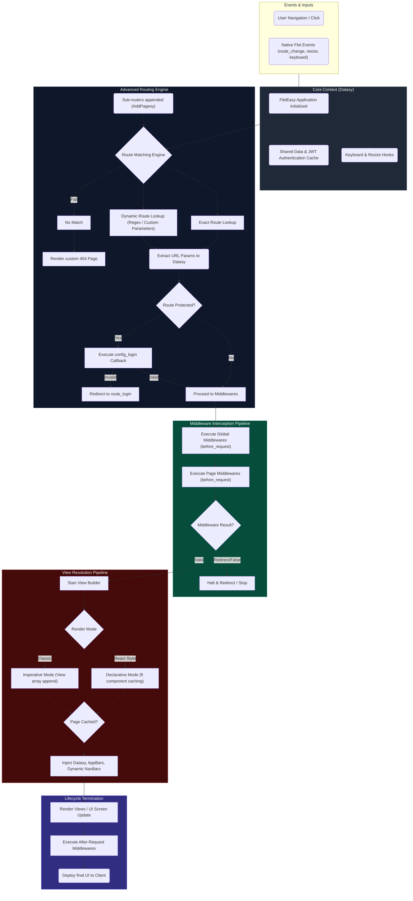

# 🔥Flet-Easy

<div align="center">

[](https://github.com/Daxexs)[](https://pypi.org/project/flet-easy)

[](https://pypi.python.org/pypi/flet-easy) [](https://pypi.python.org/pypi/flet-easy) [](https://pypi.python.org/pypi/flet-easy) [](https://socket.dev/pypi/package/flet-easy) [](https://github.com/astral-sh/uv) [](https://github.com/astral-sh/ruff)   [](https://pepy.tech/project/flet-easy)
  [](https://daxexs.github.io/flet-easy/)


</div>

> [!NOTE]
> **Compatibility:** Python **3.9+** &nbsp;·&nbsp; Flet **0.27+** &nbsp;·&nbsp; 🖥️ Desktop &nbsp;·&nbsp; 🌐 Web &nbsp;·&nbsp; 📱 Mobile
> **📚 Documentation:** [daxexs.github.io/flet-easy](https://daxexs.github.io/flet-easy/)

`Flet-Easy` is a comprehensive package built as an add-on for [`Flet`](https://github.com/flet-dev/flet). It provides a clean, intuitive API with advanced routing, authentication, middleware, page caching, and responsive design capabilities for building modern desktop, web, and mobile applications — **with full compatibility from Flet v0.27 all the way to the latest releases**.

## ✨ Features (v0.3.0)

| | Feature | Description | Docs |
| --- | --- | --- | :---: |
| 🐍 | **Python 3.9+** | Works with any modern Python — uses built-in generics and type hints | — |
| ⚡ | **Flet 0.27+ Compatible** | Tested across `0.27.*` → `0.80+` with automatic API fallbacks | — |
| 🖥️ | **All Platforms** | Desktop (Win/macOS/Linux), Web, and Mobile from a single codebase | — |
| 🛣️ | **Advanced Routing** | Dynamic URLs, regex validation, custom 404, and NavigationBar integration | [**`Docs`**](https://daxexs.github.io/flet-easy/dev/guide/add-pages/through-decorators/) |
| 🎭 | **Dual Rendering Modes** | Supports both **Imperative** and **Declarative** (`@ft.component`) routing | [**`Docs`**](https://daxexs.github.io/flet-easy/dev/guide/routing/declarative/) |
| 💾 | **Page Caching** | Per-page state preservation — controls keep their values across navigation | [**`Docs`**](https://daxexs.github.io/flet-easy/dev/advanced/page-caching/) |
| 🔐 | **JWT Authentication** | Built-in HS256 / RS256 / RS512 session management with auto-logout | [**`Docs`**](https://daxexs.github.io/flet-easy/dev/advanced/basic-jwt/) |
| 🔒 | **Route Protection** | Guard routes by login state with `protected_route` and `config_login` | [**`Docs`**](https://daxexs.github.io/flet-easy/dev/advanced/route-protection/) |
| 🔧 | **Enhanced Middleware** | Global and per-page interceptors, functional and class-based | [**`Docs`**](https://daxexs.github.io/flet-easy/dev/advanced/middleware/) |
| 🔗 | **Concurrency-Safe** | `contextvars` session isolation — safe in multi-user async environments | — |
| 🎨 | **Sub-router Modules** | Organize pages with `AddPagesy` and independent route prefixes | [**`Docs`**](https://daxexs.github.io/flet-easy/dev/guide/add-pages/through-decorators/) |
| 🎛️ | **Dynamic Controls** | Real-time UI updates with `dynamic_control()`, even on cached pages | [**`Docs`**](https://daxexs.github.io/flet-easy/dev/guide/core/datasy/) |
| 🗂️ | **Data Sharing** | Controlled sharing of data between pages with `share_data` | [**`Docs`**](https://daxexs.github.io/flet-easy/dev/advanced/data-sharing-between-pages/) |
| ⌨️ | **Keyboard Events** | Easy `on_keyboard_event` integration per page | [**`Docs`**](https://daxexs.github.io/flet-easy/dev/advanced/events/keyboard-event/) |
| 📐 | **Responsive Design** | `ResponsiveControlsy` + `on_resize` for adaptive desktop/tablet/mobile layouts | [**`Docs`**](https://daxexs.github.io/flet-easy/dev/advanced/responsiveControlsy/) |
| 🌐 | **Works with Other Apps** | Integrate with FastAPI, Django, and other Python web frameworks | [**`Docs`**](https://daxexs.github.io/flet-easy/dev/advanced/integration/working-with-other-apps/) |
| 📦 | **App Packaging** | Supports Flet's official packaging for distribution on all platforms | [**`view`**](https://flet.dev/docs/publish) |
| 🛠️ | **CLI Scaffolding** | `fs init` generates a ready-to-run project structure instantly | [**`Docs`**](https://daxexs.github.io/flet-easy/dev/cli/create-app/) |
| 📚 | **Full Docs & Examples** | Step-by-step guides, API reference, and practical code examples | [**`Docs`**](https://daxexs.github.io/flet-easy/) |

## 🔄 How Flet-Easy Works (Architecture Flow)

Here is a high-level visual flowchart illustrating the lifecycle of a request within `Flet-Easy`, integrating routing, caching, and state management mechanisms for both Declarative (`@ft.component`) and Imperative models.


```mermaid
flowchart TD
    %% Triggers
    subgraph Triggers ["Events & Inputs"]
        UserAction("User Navigation / Click") 
        FletEvents("Native Flet Events (route_change, resize, keyboard)")
    end

    %% State and Configuration
    subgraph Core ["Core Context (Datasy)"]
        InitApp("FletEasy Application initialized")
        StateData("Shared Data & JWT Authentication Cache")
        EventData("Keyboard & Resize Hooks")
        InitApp -.-> StateData
        InitApp -.-> EventData
    end
    
    Triggers --> InitApp

    %% Routing
    subgraph Engine ["Advanced Routing Engine"]
        SubRouters("Sub-routers appended (AddPagesy)") -.-> Matcher
        Matcher{"Route Matching Engine"}
        
        MatchExact["Exact Route Lookup"]
        MatchDynamic["Dynamic Route Lookup (Regex / Custom Parameters)"]
        
        Matcher --> MatchExact
        Matcher --> MatchDynamic
        
        NoMatch["No Match"]
        Page404["Render custom 404 Page"]
        Matcher -->|Fail| NoMatch --> Page404
        
        ExtractData("Extract URL Params to Datasy")
        MatchExact --> ExtractData
        MatchDynamic --> ExtractData
        
        AuthCheck{"Route Protected?"}
        ExtractData --> AuthCheck
        
        VerifyLogin["Execute config_login Callback"]
        RedirLogin["Redirect to route_login"]
        
        AuthCheck -->|Yes| VerifyLogin
        VerifyLogin -->|Invalid| RedirLogin
        
        AuthPassed["Proceed to Middlewares"]
        AuthCheck -->|No| AuthPassed
        VerifyLogin -->|Valid| AuthPassed
    end

    InitApp --> Matcher

    %% Middlewares
    subgraph Middlewares ["Middleware Interception Pipeline"]
        GlobalMid["Execute Global Middlewares (before_request)"]
        PageMid["Execute Page Middlewares (before_request)"]
        MidResult{"Middleware Result?"}
        MidStop["Halt & Redirect / Stop"]
        
        AuthPassed --> GlobalMid --> PageMid --> MidResult
        MidResult -->|Redirect/False| MidStop
    end

    %% UI Resolution
    subgraph ViewBuilder ["View Resolution Pipeline"]
        ViewStart["Start View Builder"]
        MidResult -->|Valid| ViewStart
        
        ModeEval{"Render Mode"}
        Declarative["Declarative Mode (ft component caching)"]
        Imperative["Imperative Mode (View array append)"]
        
        ViewStart --> ModeEval
        ModeEval -->|React Style| Declarative
        ModeEval -->|Classic| Imperative
        
        ResolveRouteCache{"Page Cached?"}
        Declarative --> ResolveRouteCache
        Imperative --> ResolveRouteCache
        
        InjectData["Inject Datasy, AppBars, Dynamic NavBars"]
        ResolveRouteCache -.-> InjectData
    end

    %% Final
    subgraph LifecycleEnd ["Lifecycle Termination"]
        Render["Render Views / UI Screen Update"]
        AfterReq["Execute After-Request Middlewares"]
        Finish("Deploy final UI to Client")
        
        InjectData --> Render --> AfterReq --> Finish
    end
    
    %% Colors & Styling
    style Core fill:#1f2937,stroke:#374151,color:#f3f4f6
    style Engine fill:#0f172a,stroke:#1e293b,color:#f8fafc
    style Middlewares fill:#064e3b,stroke:#0f766e,color:#ecfdf5
    style ViewBuilder fill:#450a0a,stroke:#7f1d1d,color:#fef2f2
    style LifecycleEnd fill:#312e81,stroke:#4338ca,color:#eef2ff
```

## 📌 Flet events it handles

* `on_route_change` : Dynamic routing
* `on_view_pop`
* `on_keyboard_event`
* `on_resize`
* `on_error`
  
## 💻 Ways to install

### Install Flet-Easy Complete

> [!NOTE]
> If you use the [`fs`](https://daxexs.github.io/flet-easy/dev/cli/create-app/) cli, it is important to have [`git`](https://git-scm.com/downloads) installed.

Installs all the dependencies to use, you can use all the functionalities provided by FletEasy

```bash
pip install flet-easy[all]
```

---

### Install clean Flet-Easy

> [!TIP]
> [Recommended for `Flet` Packaging Application](https://flet.dev/docs/publish).

Requires installation of [Flet >= 0.28.0](https://github.com/flet-dev/flet).

```bash
pip install flet[all]
```

#### If you do not use: [CLI-to-create-app](https://daxexs.github.io/flet-easy/dev/cli/create-app/)

```bash
pip install flet-easy
```

---

#### Install FletEasy if you need to use [Basic-JWT](https://daxexs.github.io/flet-easy/dev/advanced/basic-jwt/)

```bash
pip install flet-easy[JWT]
```

---

## 💻 Update

```bash
pip install flet-easy[all] --upgrade
```

## 🔥 Flet-Easy app example

Here is an example showcasing the new NavigationBar layout and routing features:

```python
import flet as ft
import flet_easy as fs

app = fs.FletEasy(route_init="/home")

# 1. Define a Global View
# This layout (AppBar, NavigationBar, etc.) will be shared across pages
@app.view
def main_view(data: fs.Datasy):
    return fs.Viewsy(
        appbar=ft.AppBar(
            title=ft.Text("My Flet-Easy App"),
            bgcolor=ft.Colors.BLUE,
        ),
        navigation_bar=ft.NavigationBar(
            destinations=[
                ft.NavigationBarDestination(icon=ft.Icons.HOME, label="Home"),
                ft.NavigationBarDestination(icon=ft.Icons.INFO, label="About"),
            ],
            on_change=data.go_navigation_bar, # Handles automatic routing via index
        ),
        bgcolor=ft.Colors.GREY_50,
    )

# 2. Create the Home Page
@app.page("/home", title="Home", index=0) # index=0 matches the first Nav interface
def home_page(data: fs.Datasy):
    data.view.appbar.title = ft.Text("Welcome Home! 🏠")

    return ft.View(
        controls=[
            ft.Text("Welcome to Flet-Easy! 🎉", size=30, weight=ft.FontWeight.BOLD),
            ft.Text("Now with page caching and NavigationBar support!", size=16),
            ft.ElevatedButton(
                "Go to About",
                on_click=lambda _: data.go_route("/about"), # Direct navigation
            ),
        ],
        appbar=data.view.appbar,
        navigation_bar=data.view.navigation_bar,
        vertical_alignment="center",
        horizontal_alignment="center",
    )

# 3. Create the About Page
@app.page("/about", title="About", index=1)
def about_page(data: fs.Datasy):
    data.view.appbar.title = ft.Text("About Flet-Easy")

    return ft.View(
        controls=[
            ft.Text("About Flet-Easy", size=24),
            ft.Text("Build amazing apps with Python and new caching features!"),
            ft.ElevatedButton("← Back Home", on_click=lambda _: data.go_back()),
        ],
        appbar=data.view.appbar,
        navigation_bar=data.view.navigation_bar,
        vertical_alignment="center",
        horizontal_alignment="center",
    )

# 4. Run the application
if __name__ == "__main__":
    app.run()
```

## 🎬 **Demo**


## 🚀 How to use `Flet-Easy`?

> [!IMPORTANT]
> 📑 Documentation: <https://daxexs.github.io/flet-easy/>

## 👀 Code examples

> [!TIP]
> <https://github.com/Daxexs/flet-easy/tree/main/tests>

## 🔎 Contribute to this project

Read the [CONTRIBUTING.md](https://github.com/Daxexs/flet-easy/blob/main/CONTRIBUTING.md) file

## 🧾 License

[Apache License 2.0](https://choosealicense.com/licenses/apache-2.0/)
