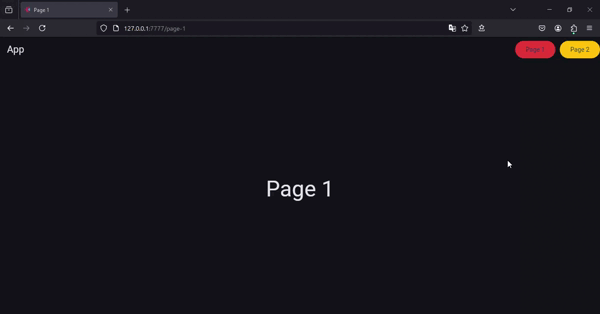

# Through classes
Create new pages (`View`) by using classes, you don't need to inherit from any other class to add the page, you just need to:

* Use the [`page`](/flet-easy/0.2.4/how-to-use/#decorator-page) decorator.
* The constructor must have as mandatory parameter [`data:fs.Datasy`](/flet-easy/0.2.4/how-to-use/#datasy-data) and if it receives a parameter bymeans of the url it must be used as parameter.
* That the class to use must have a mandatory method called `build` that will return `View` from flet, itcan be async if necessary. This `build` method does not receive any parameter.

🤔 **why use a class?**

The class can have several benefits, such as inheritance which is useful to avoid repeating code, among others.

!!! note "Soporta async"

## **Example**

```python title="main.py" hl_lines="4-6 9 39-41 44 53-55 59 67"
import flet as ft
import flet_easy as fs

app = fs.FletEasy(
    route_init="/page-1",
)

# ----------------- Custom class for multiple pages to use --------------------
class Custom:
    def __init__():
        pass

    def custom_appbar(self):
        return ft.AppBar(
            title=ft.Text("App"),
            actions=[
                ft.Row(
                    controls=[
                        ft.FilledButton(
                            "Page 1",
                            on_click=self.data.go("/page-1"),
                            style=ft.ButtonStyle(
                                bgcolor=ft.colors.RED_600,
                            ),
                        ),
                        ft.FilledButton(
                            "Page 2",
                            on_click=self.data.go("/page-2/100"),
                            style=ft.ButtonStyle(
                                bgcolor=ft.colors.AMBER_500,
                            ),
                        ),
                    ]
                )
            ],
        )

# -------------------------------- Add page 1 --------------------------------
@app.page(route="/page-1", title="Page 1")
class Page1(Custom):
    def __init__(self, data: fs.Datasy):
        self.data = data

    def build(self):
        return ft.View(
            controls=[ft.Text("Page 1", size=50)],
            appbar=self.custom_appbar(),
            vertical_alignment="center",
            horizontal_alignment="center",
        )

# -------------------------------- Add page 2 --------------------------------
@app.page(route="/page-2/{id}", title="Page 2")
class Page2(Custom):
    def __init__(self, data: fs.Datasy, id: int):
        self.data = data
        self.id = id

    def build(self):
        return ft.View(
            controls=[ft.Text(f"Page 2: \nID-URL = {self.id}", size=50)],
            appbar=self.custom_appbar(),
            vertical_alignment="center",
            horizontal_alignment="center",
        )

app.run()
```

## 🎬 **Demo**
