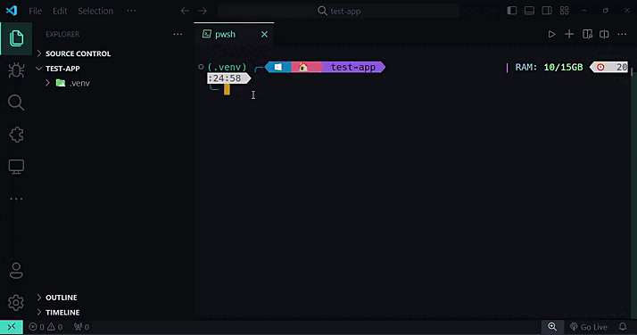

To start with a project with a structure that is familiar with `FletEasy`, with a design pattern based on `MVC`, you will need a `FletEasy` design pattern.

## App structure


## CLI
```bash
fs init
```

### 🎬 **Mode**
