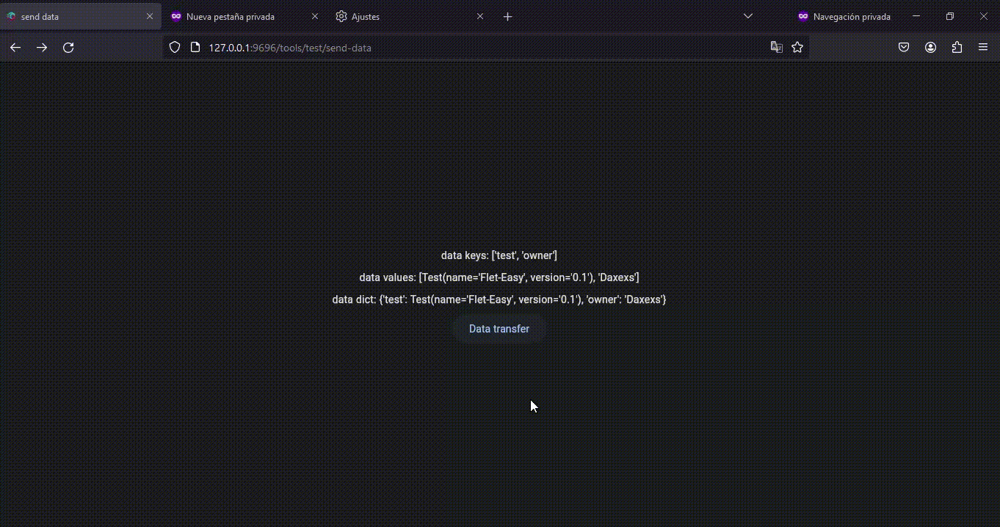

To be able to manipulate the data between client sessions, `data.share` is used, `data` is the parameter of the function decorated by `page`. Unlike `page.session` this allows a better protection of the data that you want to share in the pages, because through the `share_data` parameter of the `page` decorator you can limit to which pages you want to share the data, if the page does not have permission to share the data it will be automatically deleted. The methods to use are similar `page.session` [example](https://flet.dev/docs/guides/python/session-storage). 

Besides that you get some extra methods:

* `contains` : Returns a boolean, it is useful to know if there is shared data.
* `get_values` : Get a list of all shared values.
* `get_all` : Get the dictionary of all shared values.

## **Example**
It can be created in different file.py, for example using the `AddPagesy` class of `Flet-Easy` and then added to the main.py file.

In this case page #1 creates the data to be shared with the other pages that have the `share_data` parameter of the `page` decorator enabled. With that in mind page #3 will not be able to access the shared data, in which case the shared data will be deleted automatically. (This works on pages that redirect continuously, if you switch to a page that does not allow data sharing, it will be deleted).

```python hl_lines="11 16-17 35 41-46 69 75-81"
from dataclasses import dataclass
....
...

@dataclass
class Test:
    name:int
    version:str

# 1  
@app.page('/send-data', share_data=True)
async def send_data_page(data:fs.Datasy):
    page = data.page
    page.title = 'send data'
    
    data.share.set('test', Test('Flet-Easy', '0.1'))
    data.share.set('owner', 'Daxexs')
    
    return ft.View(
        route='/send-data',
        controls=[
            ft.Text(f'data keys: {data.share.get_keys()}'),
            ft.Text(f'data values: {data.share.get_values()}'),
            ft.Text(f'data dict: {data.share.get_all()}'),
            ft.ElevatedButton(
                'View shared data',
                key='/data',
                on_click=data.go_async)
        ],
        vertical_alignment=ft.MainAxisAlignment.CENTER,
        horizontal_alignment=ft.CrossAxisAlignment.CENTER
    )

# 2
@app.page('/data',share_data=True)
async def get_data_page(data: fs.Datasy):
    page = data.page
    page.title = 'data'
    
    # It is checked if there is data stored in the dictionary (data.share.set).
    if data.share.contains():
        x: Test = data.share.get('test')
        y: str = data.share.get('owner')
        res = ft.Text(f'Name: {x.name}\nVersion: {x.version}\n-----\nOwner: {y}')
    else:
        res = ft.Text('No value passed on the page!.')

    return ft.View(
        route='/data',
        controls=[
            ft.Container(
                content=res,
                padding=20,
                border_radius=20,
                bgcolor=ft.colors.BLACK26
            ),
            ft.ElevatedButton(
                'Check the following page for matched data',
                key='/info',
                on_click=data.go_async
            )
        ],
        vertical_alignment=ft.MainAxisAlignment.CENTER,
        horizontal_alignment=ft.CrossAxisAlignment.CENTER
    )

# 3
@app.page('/info')
async def info_page(data: fs.Datasy):
    page = data.page

    page.title = "Information"

    # It is checked if there is data stored in the dictionary (data.share.set).
    if data.share.contains():
        x: Test = data.share.get('test')
        y: str = data.share.get('owner')
        res = ft.Text(
            f'Name: {x.name}\nVersion: {x.version}\n-----\nOwner: {y}')
    else:
        res = ft.Text('No value passed on the page!.')

    return ft.View(
        route='/info',
        controls=[
            ft.Text('Access to shared data?'),
            ft.Container(
                content=res,
                padding=20,
                border_radius=20,
                bgcolor=ft.colors.BLACK26
            )
        ],
        vertical_alignment=ft.MainAxisAlignment.CENTER,
        horizontal_alignment=ft.CrossAxisAlignment.CENTER
    )
```
### Mode

