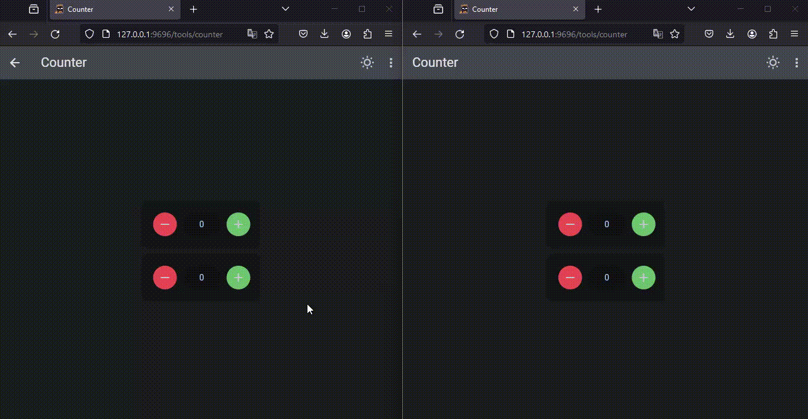

## How to use `Flet-Easy`?
Flet-Easy` presents a structure according to how the user wants to adapt it, since it allows to have several files and connect them to a main file.

* To use `Flet-easy`, first you have to use the `FletEasy` class and create an object where you can make the app configurations.
we create the app object, in it you can configure:

    * `route_prefix` : The path that is different from '/'.
    * `route_init` : The initial path when initializing the app
    * `route_login` : The path that will be redirected when the app has path protection configured.
    * `on_Keyboard` : Activate the event on_Keyboard, by default it is deactivated (False).
    * `on_resize` : Activate the event on_resize, by default it is deactivated (False).
  
## **Example**
```Python
import flet_easy as fs

app = fs.FletEasy(
    route_prefix='/hi',
    route_init='/hi',
    route_login='/hi/login',
)
```

## How to create a new page?
To create a new page a decorator that offers the object created by the `FletEasy` class, which is `page` that allows to enter certain parameters, is used.

## Decorator page

### `route`
Text string of the url, for example('/FletEasy').

### `clear`
Removes the pages from the page.views list of flet. (optional)

### `share_data`
It is a boolean value, which is useful if you want to share data between pages, in a more restricted way. [More information](/flet-easy/Data-sharing-between-pages)

### `protected_route`
Protects the route of the page, according to the configuration of the login decorator of the FletEasy class. (optional)

### `custom_params`
To add parameter validation in the custom url using a dictionary, where the key is the name of the parameter validation and the value is the custom function that should return a value (boolean if false). [view](/flet-easy/dynamic-routes/#custom-validation)

## **Example**
```Python hl_lines="1 6"
@app.page(route="/home")
def home_page(data: fs.Datasy):
    page = data.page
    page.title = "Flet-Easy"

    return ft.View(
        route="/flet-easy",
        controls=[
            ft.Text("Home page"),
        ],
        vertical_alignment=ft.MainAxisAlignment.CENTER,
        horizontal_alignment=ft.CrossAxisAlignment.CENTER,
    )
```
The decorated function will always receive a parameter which is `data` (can be any name), which will make an object of type `Datasy` of `Flet-Easy`.
This class has the following attributes, in order to access its data:

* `page` : We get the values of the page provided by `Flet` [More information](https://flet.dev/docs/controls/page) .
* `url_params` : We obtain a dictionary with the values passed through the url.
* `view` : Get a `View` object from `Flet` [More information](https://flet.dev/docs/controls/view), previously configured with the `view` decorator of `Flet-Easy`.
* `route_prefix` : Value entered in the `FletEasy` class parameters to create the app object.
* `route_init` : Value entered in the `FletEasy` class parameters to create the app object.
* `route_login` : Value entered in the `FletEasy` class parameters to create the app object.
* `share` : It is used to be able to store and to obtain values in the client session, the utility is to be able to have greater control in the pages in which it is wanted to share and not in all the pages. [More information](/flet-easy/Data-sharing-between-pages/)
* `on_keyboard_event` : Get event values to use in the page. [view](/flet-easy/Events/keyboard-event/)
* `on_resize` : Get event values to use in the page. [view](/flet-easy/Events/On-resize/)
* `logaut | logaut_async` : Method to close sessions of all sections in the browser (client storage), requires as parameter the key or the control (the parameter key of the control must have the value to delete), this is to avoid creating an extra function.
* `update_login | update_login_async` : Method to create sessions of all sections in the browser (client storage), requires as parameters the key and the value, the same used in the `page.client_storage.set` method.
* `go | go_async` : Method to change the path of the application, in order to reduce the code, you must assign the value of the `key` parameter of the `control` used, for example buttons.

!!! info "logaut and update_login"
    Compatible with android, ios, windows and web.

## Mode
