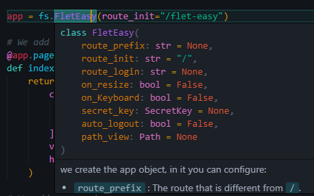
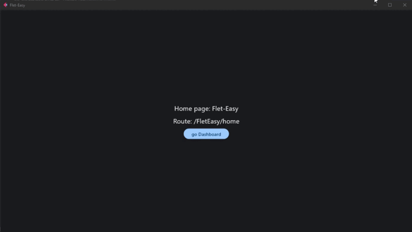

## How to use `Flet-Easy`?
`Flet-Easy` presents a structure according to how the user wants to adapt it, since it allows to have several files and connect them to a main file.

* To use `Flet-easy`, first we have to use the `FletEasy` class and create an object where to make the app configurations.

We create the app object, in which you can configure:

* `route_prefix` : The route that is different from ` /`.
* `route_init` : The initial route to initialize the app, by default is `/`.
* `route_login` : The route that will be redirected when the app has route protectionconfigured.
* `on_Keyboard` : Enables the on_Keyboard event, by default it is disabled (False). [`view`](/flet-easy/0.2/Events/keyboard-event/)
* `on_resize` : Triggers the on_resize event, by default it is disabled (False). [`view`](/flet-easy/0.2/Events/On-resize/)
* `secret_key` : Used with `SecretKey` class of FletEasy, to configure JWT or client storage. [`view`](/flet-easy/0.2/Basic-JWT/)
* `auto_logout` : If you use JWT, you can configure it.
* `path_views` : Configuration of the folder where are the .py files of the pages, you use the `Path` class to configure it. [`view`](/flet-easy/0.2/Add-pages/In-automatic/)

### 📷 **Mode**

  
### **Example**
```Python
import flet_easy as fs

app = fs.FletEasy(
    route_prefix='/FletEasy',
    route_init='/FletEasy/home',
)
```

## How to create a new page?
To create a new page you use a decorator that provides the object created by the `FletEasy` class, which is `page` that allows you to enter certain parameters.

To add pages, the following parameters are required:

* `route`: text string of the url, for example(`'/FletEasy'`).
* `title`: Defines the title of the page.
* `clear`: Removes the pages from the `page.views` list of flet (optional).
* `share_data` : Is a boolean value, useful if you want to share data between pages, in a morerestricted way (optional). [`view`](/flet-easy/0.2/Data-sharing-between-pages/)
* `protected_route`: Protects the page path, according to the `login` decorator configurationof the `FletEasy` class (optional). [`view`](/flet-easy/0.2/Customized-app/Route-protection/)
* `custom_params`: To add parameter validation in the custom url using a dictionary, where thekey is the parameter validation name and the value is the custom function that should report aboolean value. [`view`](/flet-easy/0.2/dynamic-routes/#custom-validation)
* `middleware` : Acts as an intermediary between different software components, intercepting andprocessing requests and responses. They allow adding functionalities to an application in aflexible and modular way.  It can be used in the app in general, as well as in each of thepages (optional). [`view`](/flet-easy/0.2/Midleware/)


### **Example**
```Python hl_lines="1 16"
@app.page(route="/home", title="Flet-Easy")
def home_page(data: fs.Datasy):
    page = data.page

    return ft.View(
        controls=[
            ft.Text(f"Home page: {page.title}"),
            ft.Text(f"Route: {page.route}"),
            ft.FilledButton("go Home", on_click=data.go(f"{data.route_prefix}/dashboard")),
        ],
        vertical_alignment="center",
        horizontal_alignment="center",
    )


@app.page(route="/dashboard", title="Dashboard")
def dashboard_page(data: fs.Datasy):
    page = data.page

    return ft.View(
        controls=[
            ft.Text(f"Home page: {page.title}"),
            ft.Text(f"Route: {page.route}"),
            ft.FilledButton("go Home", on_click=data.go(data.route_init)),
        ],
        vertical_alignment="center",
        horizontal_alignment="center",
    )

app.run()
```

## Datasy (data)
The decorated function will always receive a parameter which is `data` (can be any name), which will make an object of type `Datasy` of `Flet-Easy`.

This class has the following attributes, in order to access its data:

* `page` : We get the values of the page provided by [`Flet`](https://flet.dev/docs/controls/page) .
* `url_params` : We obtain a dictionary with the values passed through the url.
* `view` : Get a `View` object from [`Flet`](https://flet.dev/docs/controls/view), previouslyconfigured with the `view` decorator of `Flet-Easy`.
* `route_prefix` : Value entered in the `FletEasy` class parameters to create the app object.
* `route_init` : Value entered in the `FletEasy` class parameters to create the app object.
* `route_login` : Value entered in the `FletEasy` class parameters to create the app object.
---
* `share` : It is used to be able to store and to obtain values in the client session, theutility is to be able to have greater control in the pages in which it is wanted to share, forit the parameter `share_data` of the `page` decorator must be used. The methods to use aresimilar [`page.session`](https://flet.dev/docs/guides/python/session-storage). [`view`](/flet-easy/0.2/Data-sharing-between-pages/)
Besides that you get some extra methods:
    * `contains` : Returns a boolean, it is useful to know if there is shared data.
    * `get_values` : Get a list of all shared values.
    * `get_all` : Get the dictionary of all shared values.
---

* `on_keyboard_event` : get event values to use in the page. [`view`](/flet-easy/0.2/Events/keyboard-event/)
* `on_resize` : get event values to use in the page. [`view`](/flet-easy/0.2/Events/On-resize/)
* `route` : route provided by the route event, it is useful when using middlewares to check if the route is assecible.

### **Methods**

* `logout` : method to close sessions of all sections in the browser (client storage), requires as parameter the key or the control (the key parameter of the control must have the value to delete), this is to avoid creating an extra function.
* `login` : Method to create sessions of all sections in the browser (client storage), requires as parameters the key and the value, the same used in the `page.client_storage.set` method.
* `go` : Method to change the application path (recommended to use this instead of `page.go` to avoid path errors).
* `redirect` : To redirect to a path before the page is loaded, it is used in middleware.


!!! info "logaut and login"
    Compatible with android, ios, windows and web.

## 🎬 **Mode**
