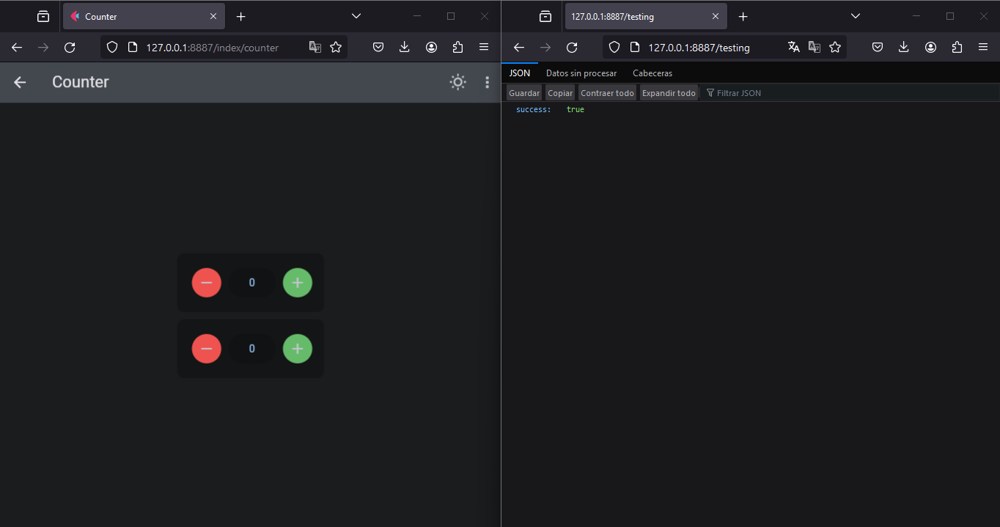

## Working with other apps and creating apis
To be able to function our main app with other apps, besides being able to create apis from the same url path with the same host and port. First we must obtain the main of the app to be able to mount in another app. For it we are going to use the `fastapi` method.

!!! note "More information"
    * [Here](https://flet.dev/docs/guides/python/deploying-web-app/running-flet-with-fastapi#hosting-multiple-flet-apps-under-the-same-domain)

### **Example**
```python hl_lines="7"
.......
.......

import flet_fastapi

# getting the main value of the app.
page_app = app.fastapi()

app_main = flet_fastapi.FastAPI()

# Creating a basic test api.
@app_main.get('/testing')
def test_api():
    return {'success': True}

app_main.mount('/', flet_fastapi.app(page_app))
```
**Run the app**
```bash
uvicorn main:app_main
```
### **Mode**

