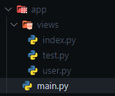

# By means of functions

## Adding pages to the main app without using decorators

For this we will require the [`add_routes`](/flet-easy/0.1.0/how-to-use/#methods) method of the object created by the [`FletEasy`](/flet-easy/0.1.0/how-to-use/#fleteasy) class.

!!! note "Soporta async"

## App structure



### **Example using functions**

```python title="index.py" hl_lines="4"
import flet_easy as fs
import flet as ft

def page_index(data: fs.Datasy):
    data.page.title = "index"

    return ft.View(
        controls=[
            ft.Text('Index'),
            ft.filledButton(
                "Go to test",
                key="/test",
                on_click=data.go
                ),
        ],
        vertical_alignment="center",
        horizontal_alignment="center"

    )
```

```python title="test.py" hl_lines="4"
import flet_easy as fs
import flet as ft

def page_test(data: fs.Datasy):
    data.page.title = "Test"

    return ft.View(
        controls=[
            ft.Text('Test'),
            ft.Text(f'Id: {self.id}'),
            ft.Text(f'Name: {self.name}'),
            ft.FilledButton(
                        "Go index",
                        key="/index",
                        on_click=data.go,
                    ),
        ],
        vertical_alignment="center",
        horizontal_alignment="center"
)
```

### Add routes

We import the functions or classes from the `views` folder, then we use the [`add_routes`](/flet-easy/0.1.0/how-to-use/#methods) method of the [FletEasy](/flet-easy/0.1.0/how-to-use/#fleteasy) instance, in which we will add a list of [`Pagesy`](/flet-easy/0.1.0/add-pages/by-means-of-functions/#pagesy) classes where we will configure the routes and the functions or classes to be used in addition to others.

```python title="main.py" hl_lines="13-21"
import flet_easy as fs
import flet as ft

# Import functions from a `views` folder
from views.user import users
from views.index import page_index
from views.test import page_test

app = fs.FletEasy(
    route_init="/index"
)
# Add routes without the use of decorators
app.add_routes(add_views=[
    fs.Pagesy('/index', page_index),
    fs.Pagesy('/user/task', page_users),
    fs.Pagesy(
              '/test/{id:d}/user/{name:l}',
              page_test,
              protected_route=True
            ),
])

app.run(view=ft.AppView.WEB_BROWSER)
```

## Pagesy

📑 The class `Pagesy`, it requires the following parameters:

!!! warning "In version 0.1.0 `protected_route` is `proctect_route`"

!!! warning "`share_data` is available from version 0.1.3"

* `route`: text string of the url, for example(`'/index'`).
* `view`: Stores the page function.
* `clear`: Removes the pages from the `page.views` list of flet. (optional)
* `share_data` : It is a boolean value, which is useful if you want to share data between pages, in a morerestricted way. (optional) [[`See more`]](/flet-easy/0.1.0/data-sharing-between-pages/)
* `protected_route`: Protects the route of the page, according to the configuration of the `login` decoratorof the `FletEasy` class. (optional) [[`See more`]](/flet-easy/0.1.0/customized-app/route-protection/)
* `custom_params`: To add validation of parameters in the custom url using a dictionary, where the key is the nameof the parameter validation and the value is the custom function that must report a boolean value. [[`See more`]](/flet-easy/0.1.0/dynamic-routes/#custom-validation)
