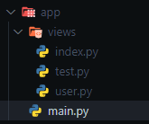

# In automatic

It forgets the imports of each of the .py files and the functions or variables of the pages. For this you must have a proper order where all the .py files that contain each page must be in a folder, for example `views`. The configuration is done in the [`FletEasy`](/flet-easy/0.2.0/how-to-use/#fleteasy) class of the [`path_views`](/flet-easy/0.2.0/how-to-use/#fleteasy) parameter and in each of the .py files use the [`AddPages`](/flet-easy/0.2.0/add-pages/through-decorators/#addpagesy) class.

## App structure



### **Example**

```python title="user.py" hl_lines="4-6 12 24"
import flet_easy as fs
import flet as ft

users = fs.AddPagesy(
    route_prefix='/user'
)

# -> Urls to be created:
# * '/user/task'
# * '/user/information'

@users.page('/task', title='Task')
def task_page(data: fs.Datasy):

    return ft.View(
        controls=[
            ft.Text('Task'),
        ],
        vertical_alignment="center",
        horizontal_alignment="center"

    )

@users.page('/information', title='Information')
async def information_page(data: fs.Datasy):

    return ft.View(
        controls=[
            ft.Text('Information'),
        ],
        vertical_alignment="center",
        horizontal_alignment="center"

    )
```

The `main.py` file will automatically recognize the pages created in each of the .py files in the `views` folder.

```Python title="main.py" hl_lines="2 6"
import flet_easy as fs
from pathlib import Path

app = fs.FletEasy(
    route_init='/user/task',
    path_views=Path(__file__).parent / "views",
)

app.run()
```
