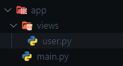

# Through decorators

## Add pages from other files to the main application

In order to create a page in a `file.py` different from the `main.py` file of the app, you need to use the `AddPagesy` class.

### `AddPagesy`

Requires the parameter:

* `route_prefix`: text string that will bind to the url of the page decorator, example(/users) this will encompass all urls of this class. (optional)

Methods:

* `page()` : Decorator to add a new page to the app. This decorator method acts similarly to the `Pagesy` class and contains the same required parameters. ([`See more`](/flet-easy/0.2.0/add-pages/by-means-of-functions/#pagesy))

!!! note "Soporta async"

## App structure



???+ Example "Urls to be created:"

    * `'/user/task'`
    * `'/user/information'`
    * `'/user/test'`

### **Example using functions**

```python title="user.py" hl_lines="4-6 13 15 28 31"
import flet_easy as fs
import flet as ft

users = fs.AddPagesy(
    route_prefix='/user'
)

# -> Urls to be created:
# * '/user/task'
# * '/user/information'
# * '/user/test'

@users.page('/task', title='Task')
def task_page(data: fs.Datasy):
    return ft.View(
        controls=[
            ft.Text('Task'),
            ft.FilledButton(
                            "Go Information",
                            on_click=data.go("/users/information"),
                        ),
        ],
        vertical_alignment="center",
        horizontal_alignment="center"

    )

@users.page('/information', title='Information')
async def information_page(data: fs.Datasy):

    return ft.View(
        controls=[
            ft.Text('Information'),
            ft.FilledButton(
                            "Go Test",
                            on_click=data.go("/users/test"),
                        ),
        ],
        vertical_alignment="center",
        horizontal_alignment="center"

    )
```

### **Example using classes**

!!! warning "Available since version 0.2.4"

Create new pages (`View`) by using classes, you don't need to inherit from any other class to add the page, you just need to:

* Use the [`page`](/flet-easy/0.2.0/how-to-use/#decorator-page) decorator.
* The constructor must have as mandatory parameter [`data:fs.Datasy`](/flet-easy/0.2.0/how-to-use/#datasy-data) and if it receives a parameter bymeans of the url it must be used as parameter.
* That the class to use must have a mandatory method called `build` that will return `View` from flet, itcan be async if necessary. This `build` method does not receive any parameter.

🤔 **why use a class?**

The class can have several benefits, such as inheritance which is useful to avoid repeating code, among others.

👀 Continuing with the previous code..

```python title="user.py" hl_lines="2 6"

@users.page('/test', title='test')
Class TestPage:
    def __init__(self, data:ft.Datasy):
        self.data = data

    async def build(self):
        return ft.View(
            controls=[
                ft.Text('Test'),
                ft.FilledButton(
                    "Go Task",
                    on_click=self.data.go("/users/task"),
                ),
            ],
            vertical_alignment="center",
            horizontal_alignment="center"
        )

```

### Adding pages

Now how to add to the main app the `main.py` file. For this we use the `add_pages` method that requires as parameter a list of all the pages of other files that we want to add.

```Python title="main.py" hl_lines="2 8"
import flet_easy as fs
from views.user import users

app = fs.FletEasy(
    route_init='/user/task',
)

app.add_pages([users])

app.run()
```

---

## without instantiating `AddPagesy`

!!! warning "Available since version 0.2.7"

Add page without creating an instance of [`AddPagesy`](/flet-easy/0.2.0/add-pages/through-decorators/#addpagesy) class. For this the `@fs.page()` decorator is used, Useful if you don't need to [share part of the URLs between pages](/flet-easy/0.2.0/add-pages/through-decorators/#app-structure)

### Example


!!! note "It is important to set `path_views` for it to work properly"

```python title="main.py" hl_lines="2 6"
import flet_easy as fs
from pathlib import Path

app = fs.FletEasy(
          route_init="/test",
          path_views=Path(__file__).parent / "views",
)

app.run()
```

---

* `views` folder file

```python title="user.py" hl_lines="2 6"
import flet_easy as fs
import flet as ft

@fs.page(route="/test")
def page_test(data:fs.Datasy):
      return ft.View(
             controls=[
                 ft.Text("Test use")
             ]
     )
```
