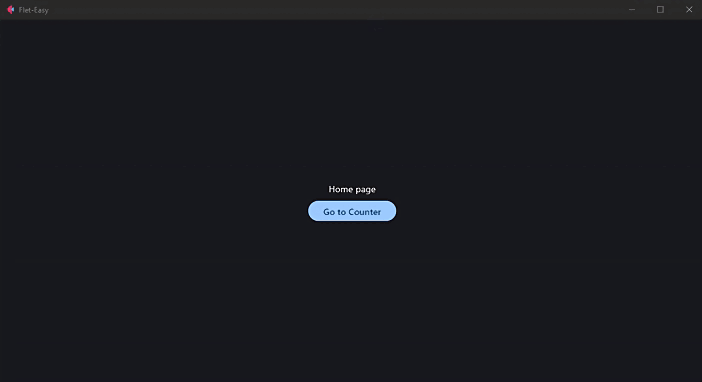

# Begin

## Flet-Easy

`Flet-Easy` is a package built as an add-on for [`Flet`](https://github.com/flet-dev/flet), designed for beginners, what it does is to facilitate the use of `Flet` when building your applications, with a tidier and simpler code.

## Features

* Easy to use (**hence the name**).
* Facilitates `flet` event handling.
* Simple page routing (There are three ways) for whichever one suits you best. [[`See more`]](/flet-easy/0.2.0/dynamic-routes/)
* App construction with numerous pages and custom flet configurations for desktop, mobile and web sites.
* Provides a better construction of your code, which can be scalable and easy to read (it adapts to your preferences, there are no limitations).
* Dynamic routing, customization in the routes for greater accuracy in sending data. [[`See more`]](/flet-easy/0.2.0/dynamic-routes/#custom-validation)
* Routing protection [[`See more`]](/flet-easy/0.2.0/customized-app/route-protection/)
* Custom Page 404 [[`See more`]](/flet-easy/0.2.0/customized-app/page-404/)
* Controlled data sharing between pages. [[`See more`]](/flet-easy/0.2.0/data-sharing-between-pages/)
* Asynchronous support.
* Middleware Support (in the app in general and in each of the pages). [[`See more`]](/flet-easy/0.2.0/middleware/)
* JWT support for authentication sessions in the data parameter. (useful to control the time of sessions) [[`See more`]](/flet-easy/0.2.0/basic-jwt/)
* Working with other applications. [[`See more`]](/flet-easy/0.2.0/working-with-other-apps/)
* CLI to create app structure `FletEasy` (`fs init`) [[`See more`]](/flet-easy/0.2.0/cli-to-create-app/)
* Easy integration of `on_keyboard_event` in each of the pages. [[`See more`]](/flet-easy/0.2.0/events/keyboard-event/)
* Use the percentage of the page width and height of the page with `on_resize`. [[`See more`]](/flet-easy/0.2.0/events/on-resize/)
* `ResponsiveControlsy` control to make the app responsive, useful for desktop applications. [[`See more`]](/flet-easy/0.2.0/responsiveControlsy/)
* Soporta Application Packaging para su distribución. [[`See more`]](https://flet.dev/docs/publish)

## Flet events it handles

* `on_route_change` :  Dynamic routing
* `on_view_pop`
* [`on_keyboard_event`](/flet-easy/0.2.0/events/keyboard-event/)
* [`on_resize`](/flet-easy/0.2.0/events/on-resize/)
* `on_error`

## App example

Here is an example of an application with 2 pages, "Home" and "Counter":

```python hl_lines="4 7 19 50"
import flet as ft
import flet_easy as fs

app = fs.FletEasy(route_init="/flet-easy")

# We add a page
@app.page(route="/flet-easy", title="Flet-Easy")
def index_page(data: fs.Datasy):
    return ft.View(
        controls=[
            ft.Text("Home page"),
            ft.FilledButton("Go to Counter", on_click=data.go("/counter")),
        ],
        vertical_alignment="center",
        horizontal_alignment="center",
    )

# We add a second page
@app.page(route="/counter", title="Counter")
def counter_page(data: fs.Datasy):
    page = data.page

    txt_number = ft.TextField(value="0", text_align="right", width=100)

    def minus_click(e):
        txt_number.value = str(int(txt_number.value) - 1)
        page.update()

    def plus_click(e):
        txt_number.value = str(int(txt_number.value) + 1)
        page.update()

    return ft.View(
        controls=[
            ft.Row(
                [
                    ft.IconButton(ft.icons.REMOVE, on_click=minus_click),
                    txt_number,
                    ft.IconButton(ft.icons.ADD, on_click=plus_click),
                ],
                alignment="center",
            ),
            ft.FilledButton("Go to Home", on_click=data.go("/flet-easy")),
        ],
        vertical_alignment="center",
        horizontal_alignment="center",
    )

# We run the application
app.run()
```

### 🎬 **Demo**


