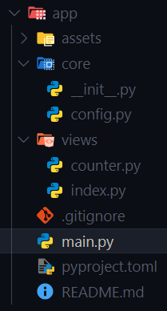
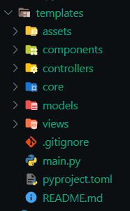
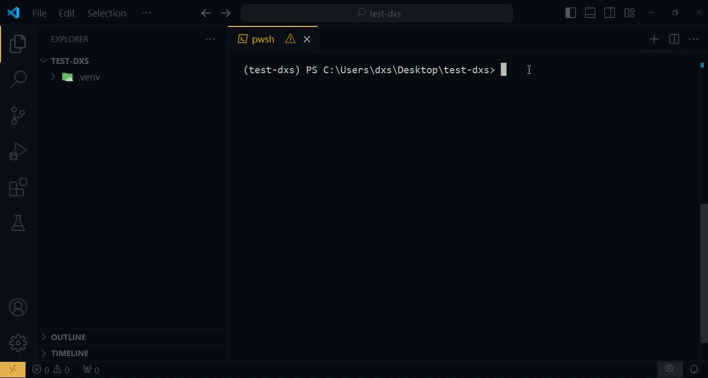

# CLI to create app

To start a project with `Flet-Easy` provides a cli to facilitate the construction of an app.

## App structure

!!! note "Structure main"


---

Which can be scaled to an app with higher requirements such as a design pattern based on MVC.
!!! note "Example structure MVC"

  
## CLI

??? tip "Remember to install FletEasy first."
     ```bash
     pip install flet-easy[all]
     ```

!!! note
    If you use the [`fs`](/flet-easy/0.2.0/cli-to-create-app/) cli, it is important to have [`git`](https://git-scm.com/downloads) installed.

```bash
fs init
```

### 🎬 **Demo**

[](https://github.com/Daxexs/fs-template-dxs)


