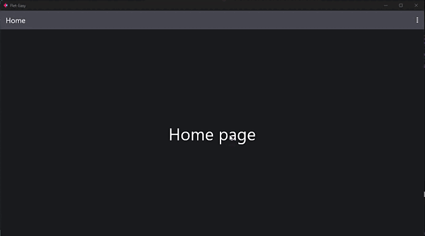

# Control view configuration

## Add settings of the `View` controller of [Flet](https://flet.dev/docs/controls/view)

Which can be reused in each of the pages through the [`data:fs.Datasy`](/flet-easy/0.2.0/how-to-use/#datasy-data) parameter in the `page` decorator function of the app.

Decorator `view` to add custom controls to the app, the decorator function will return the `Viewsy` class from FletEasy. Which will be obtained in functions with parameter `data:fs.Datasy` and can be added to the page view decorated with `page` of the FletEasy class.

* The decorator function must receive a mandatory parameter, for example: [`data:fs.Datasy`](/flet-easy/0.2.0/how-to-use/#datasy-data).
* Add universal controls to use in more than one page in a simple way.

### Example

!!! example ""
    We create an `AppBar` control of `Flet`, to be able to be reused in the other pages.
  
```python hl_lines="9-27 35 37 43 51 53 59"
import flet as ft
import flet_easy as fs

app = fs.FletEasy(route_init="/home")

@app.view
def view(data: fs.Datasy):
    return fs.Viewsy(
        appbar=ft.AppBar(
            title=ft.Text("AppBar Example"),
            center_title=False,
            bgcolor=ft.colors.SURFACE_VARIANT,
            actions=[
                ft.PopupMenuButton(
                    items=[
                        ft.PopupMenuItem(
                            text="🔥 Home",
                            on_click=data.go(data.route_init)
                            ),
                        ft.PopupMenuItem(
                            text="🔥 Dasboard",
                            on_click=data.go("/dasboard")
                            ),
                    ]
                ),
            ],
        ),
        vertical_alignment="center",
        horizontal_alignment="center",
    )

@app.page(route="/home", title="Flet-Easy", page_clear=True)
def home_page(data: fs.Datasy):
    # we obtain the values
    view = data.view
    # We can change the values of the appBar object, for example in title.
    view.appbar.title = ft.Text("Home")

    return ft.View(
        controls=[
            ft.Text("Home page", size=50),
        ],
        appbar=view.appbar,  # We reuse control
        vertical_alignment="center",
        horizontal_alignment="center",
    )

@app.page(route="/dasboard", title="Dasboard")
def dasboard_page(data: fs.Datasy):
    # we obtain the values
    view = data.view
    # We can change the values of the appBar object, for example in title.
    view.appbar.title = ft.Text("Dasboard")

    return ft.View(
        controls=[
            ft.Text("Dasboard page", size=50),
        ],
        appbar=view.appbar,  # We reuse control
        vertical_alignment="center",
        horizontal_alignment="center",
    )

app.run()
```

### 🎬 **Demo**


