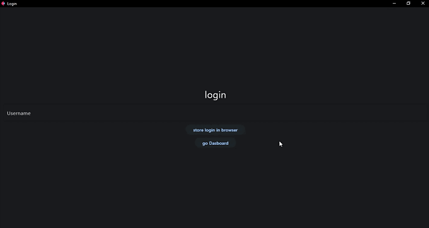

# Route protection

In order to configure the protection of routes, the [`login`](/flet-easy/0.1.0/customized-app/route-protection/#login) decorator of the created object of the app is used. The utility of this decorator is to obtain the values that we have previously registered in the `page.client_storage` [(more details here)](https://flet.dev/docs/guides/python/client-storage), then you can perform validations with a database or any data manager used.

Decorator to add a login configuration to the app [(`protected_route`)](/flet-easy/0.1.0/how-to-use/#decorator-page):

* The decorator function must receive a mandatory parameter, for example: [`page:ft.Page`](https://flet.dev/docs/controls/page/). Which can be used to get information and perform universal settings of the app.
* The decorator function must return a boolean.

!!! warning "In version 0.1.0 `protected_route` is `proctect_route`"

## Example

!!! example ""
    In this case it is a basic example, with a test on a fictitious database.

```python hl_lines="11-13 19 23 31-32 38 51"
import flet as ft
import flet_easy as fs

app = fs.FletEasy(
    route_init="/login",
    route_login="/login"
    )

db = []  # Database

@app.login
def login_x(page: ft.Page):
    username = page.client_storage.get("login")

    """ We check if a value exists with the key login """
    if username is not None and username in db:
        """We verify if the username that is stored in the browser
        is in the simulated database."""
        return True

    return False

@app.page(route="/dashboard", protected_route=True)
def dashboard_page(data: fs.Datasy):
    data.page.title = "Dashboard"

    return ft.View(
        controls=[
            ft.Text("Dash", size=30),
            # We delete the key that we have previously registered
            ft.ElevatedButton("Logaut", key="login", on_click=data.logaut),
            ft.ElevatedButton("Home", key="/login", on_click=data.go),
        ],
        vertical_alignment="center",
        horizontal_alignment="center",
    )

@app.page(route="/login")
def login_page(data: fs.Datasy):
    data.page.title = "Login"

    # create login stored user
    username = ft.TextField(label="Username")

    def store_login(e):
        db.append(username.value)  # We add to the simulated database

        """First the values must be stored in the browser, then in the login
        decorator the value must be retrieved through the key used and then
        validations must be used."""
        data.update_login(key="login", value=username.value)

    return ft.View(
        controls=[
            ft.Text("login", size=30),
            username,
            ft.ElevatedButton("store login in browser", on_click=store_login),
            ft.ElevatedButton("go Dasboard", key="/dashboard", on_click=data.go),
        ],
        vertical_alignment="center",
        horizontal_alignment="center",
    )

app.run()
```

## 🎬 **Demo**



---

## update_login / update_login_async

Registering in the client's storage the key and value in all browser sessions.

**Parameters [`data.login`](/flet-easy/0.1.0/how-to-use/#methods_1):**

* `key` : It is the identifier to store the value in the client storage.
* `value` : A value that will be stored in the client storage.

## logaut / logaut_async

Closes the sessions of all browser tabs or the device used, which has been previously configured with the `login` method.

???+ info "Use with `on_click`"
    If the `Flet` controls contain the `Key` parameter, this can act as the identifier for the `logaut` method.

    * Or also use
    ```python
    on_click=lambda e: data.logaut(<key >)
    ```

**Parameters [`data.logout`](/flet-easy/0.1.0/how-to-use/#methods_1):**

* `key` : It is the identifier to store the value in the client storage.
