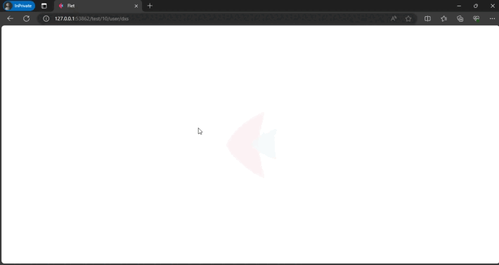
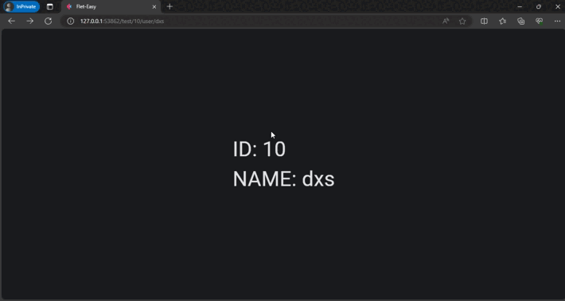
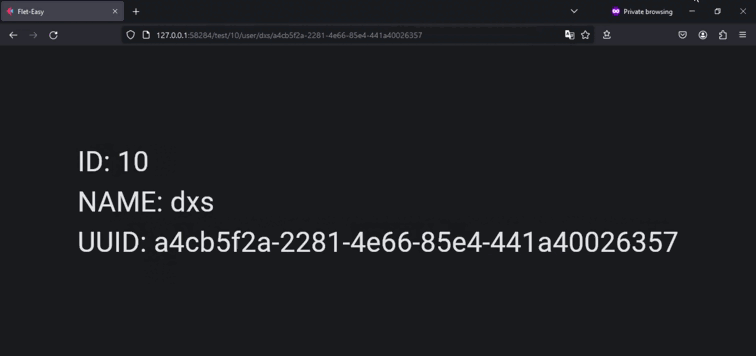

# Dynamic routes

Flet-Easy provides a simple and powerful routing to manage the access to the pages created, it contains 3 ways of use (choose the one that suits you best).

## **Simple form**

Get the values ​​of the URL parameters, using the data from the parameters of the function decorated by [`page()`](/flet-easy/0.2.0/how-to-use/#decorator-page).

???+ warning "Available from version 0.2.6"
    Any of these formats are supported:

    * `{id}`
    * `<id>`

### **Example**

```python hl_lines="6 11"
import flet as ft
import flet_easy as fs

app = fs.FletEasy(route_init="/test/10/user/dxs")

@app.page(route="/test/{id}/user/{name}", title="Flet-Easy")
def home_page(data: fs.Datasy, id, name):

    return ft.View(
        controls=[
            ft.Text(f"ID: {id} \nNAME: {name}", size=50),
        ],
        vertical_alignment="center",
        horizontal_alignment="center",
    )

app.run(view=ft.AppView.WEB_BROWSER)
```

### 🎬 Demo



## **Advanced Form**

???+ warning "Available from version 0.2.6"
    The typing of parameters within the url changes, now supporting the native python types `(:int, :str, :bool, :float`), instead of using `(:d, :l)` which were for a number and string respectively.

Utilice parámetros dinámicos en la URL para obtener datos específicos, por ejemplo, se solicita que {id:int} sea un número y {name:str} una cadena.

### **Example #1**

```python hl_lines="4 6-7 11"
import flet as ft
import flet_easy as fs

app = fs.FletEasy(route_init="/test/10/user/dxs")

@app.page(route="/test/{id:int}/user/<name:str>", title="Flet-Easy")
def home_page(data: fs.Datasy, id:int, name:str):

    return ft.View(
        controls=[
            ft.Text(f"ID: {id} \nNAME: {name}", size=50),
        ],
        vertical_alignment="center",
        horizontal_alignment="center",
    )

app.run(view=ft.AppView.WEB_BROWSER)

```

---

### **Example #2**

!!! info "Available only up to version 0.2.4"

Use dynamic parameters in the url to get specific data, for example `{id:d}` is requested to be a number and `{name:l}` a string. For more information [here](https://github.com/r1chardj0n3s/parse#format-specification)

```python hl_lines="4 6-7 11"
import flet as ft
import flet_easy as fs

app = fs.FletEasy(route_init="/test/10/user/dxs")

@app.page(route="/test/{id:d}/user/{name:l}", title="Flet-Easy")
def home_page(data: fs.Datasy, id:int, name:str):

    return ft.View(
        controls=[
            ft.Text(f"ID: {id} \nNAME: {name}", size=50),
        ],
        vertical_alignment="center",
        horizontal_alignment="center",
    )

app.run(view=ft.AppView.WEB_BROWSER)

```

### **🎬 Demo**



## **Custom validation**

???+ warning "Available from version 0.2.6"

    * The typing of parameters within the url changes, now supporting the native python types `(:int, :str, :bool, :float`), instead of using `(:d, :l)` which were for a number and string respectively.
    * The function used in `custom_params` now only supports returning `None`, to say that the url does not match, since `False` can be interpreted as a `:bool` value and could match the url. Also you can return any value in case you want to accept the url.

To control the validation of custom data in the dynamic path, you must use the `custom_params` parameter of the [`page`](/0.2.0/how-to-use/#decorator-page) decorator, in this you can enter the key and the value as a function, being a dictionary can support a wide variety of data, according to your imagination 🤔.

### **Example #1**

```python hl_lines="5-7 9-13 16 18"
from uuid import UUID
import flet as ft
import flet_easy as fs

app = fs.FletEasy(
    route_init="/test/10/user/dxs/a4cb5f2a-2281-4e66-85e4-441a40026357"
    )

def is_uuid(value:str):
    try:
        return UUID(value)
    except ValueError:
        return

@app.page(
    route="/test/{id:int}/user/{name:str}/{uuid:Uuid}",
    title="Flet-Easy",
    custom_params={"Uuid": is_uuid},
)
def home_page(data: fs.Datasy, id: int, name: str, uuid: UUID):
    return ft.View(
        controls=[
            ft.Text(f"ID: {id} \nNAME: {name}\nUUID: {uuid}", size=50),
        ],
        vertical_alignment="center",
        horizontal_alignment="center",
    )

app.run(view=ft.AppView.WEB_BROWSER)
```

---

### **Example #2**

!!! info "Available only up to version 0.2.4"

```python hl_lines="5-7 9-14 17 19"
from uuid import UUID
import flet as ft
import flet_easy as fs

app = fs.FletEasy(
    route_init="/test/10/user/dxs/a4cb5f2a-2281-4e66-85e4-441a40026357"
    )

def is_uuid(value:str):
    try:
        UUID(value)
        return value
    except ValueError:
        return False

@app.page(
    route="/test/{id:d}/user/{name:l}/{uuid:Uuid}",
    title="Flet-Easy",
    custom_params={"Uuid": is_uuid},
)
def home_page(data: fs.Datasy, id: int, name: str, uuid: str):
    return ft.View(
        controls=[
            ft.Text(f"ID: {id} \nNAME: {name}\nUUID: {uuid}", size=50),
        ],
        vertical_alignment="center",
        horizontal_alignment="center",
    )

app.run(view=ft.AppView.WEB_BROWSER)
```

### 🎬 **Demo**


  