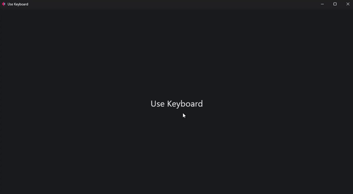

# Keyboard event

In order to use this method, the parameter of the function decorated by [`page`](/flet-easy/0.2.0/how-to-use/#decorator-page) is obtained through [`data`](/flet-easy/0.2.0/how-to-use/#datasy-data).

Manages keyboard input of values

## Methods

* `add_control(function: Callable)` : Add a controller configuration (method of a class or function), which is executed with the `on_keyboard_event` event.
* `key()` : returns the value entered by keyboard.
* `shift()` : returns the value entered by keyboard.
* `ctrl()` : returns the value entered by keyboard.
* `alt()` : returns the keyboard input.
* `meta()` : returns keyboard input.
* `test()` : returns a message of all keyboard input values (key, Shift, Control, Alt, Meta).

## Example

```python hl_lines="6 12 16-18 21"
import flet as ft
import flet_easy as fs

app = fs.FletEasy(
    route_init="/keyboard",
    on_Keyboard=True
    )

@app.page(route="/keyboard", title="Use Keyboard")
def keyboard_page(data: fs.Datasy):
    page = data.page
    on_keyboard = data.on_keyboard_event

    use_keyboard = ft.Column()

    def show_event():
        use_keyboard.controls.append(ft.Text(on_keyboard.test()))
        page.update()

    # Add function to be executed by pressing the keyboard.
    on_keyboard.add_control(show_event)

    return ft.View(
        controls=[
            ft.Text(
                "Use Keyboard",
                size=30
            ),
            use_keyboard
        ],
        vertical_alignment="center",
        horizontal_alignment="center",
    )

app.run()
```

### 🎬 **Demo**


