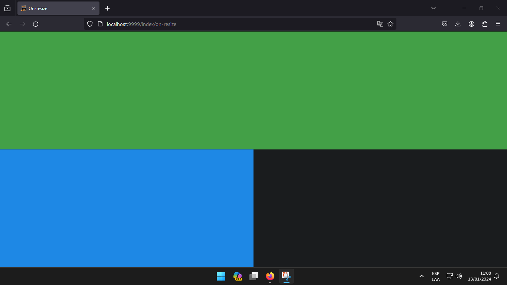

# On resize

In order to use this event, it is obtained from [`data`](/flet-easy/0.2.0/how-to-use/#datasy-data) of the function decorated by [`page`](/flet-easy/0.2.0/how-to-use/#decorator-page).

## **1. Example**

```python hl_lines="5"
@app.page(route="/resize", title="Use Resize)
def resize_page(data:fs.Datasy):

    # obtaining the values of the event.
    on_resize = data.on_resize
    
    return ft.View(
        controls=[
            ft.Text('Use Resize', size=30),
        ],
        vertical_alignment="center",
        horizontal_alignment="center"
    )
```

When we get the values of the event, we can use the methods that this `on_resize` object has.

* `heightX(<value>)` : This method allows to obtain the values of the height of the page, which requires as parameter to enter an integer value from 1 to 100 (100 = 100%).

* `widthX(<value>)` : This method is similar to the previous one in terms of page width.

Manipulation of the margin or padding of the page, this is important since it allows to use the previous methods correctly, that is to say the margin or padding of the page has to be `0` so that the previous methods work correctly, in the case that you want to put a margin, customized, you can correct it modifying in margin of `on_resize`.

!!! note
    If the `AppBar` control is used, if the padding is 0, the `on_resize` margin must be 28 on the y-axis (platform dependent).

* `margin_y` : Requires an integer value on the y-axis.
* `margin_x` : Requires an integer value on the x-axis.

## **2. Example**

```python hl_lines="10 19 23-24 28-29"
import flet as ft
import flet_easy as fs

app = fs.FletEasy(route_init="/resize")

@app.page(route="/resize", title="Use resize")
def resize_page(data:fs.Datasy):

    # obtaining the values of the event.
    on_resize = data.on_resize

    # Modifying the customized margin.
    # on_resize.margin_y = 10

    return ft.View(
        controls=[
            ft.Container(
                bgcolor=ft.colors.GREEN_600,
                height=on_resize.heightX(50)
            ),
            ft.Container(
                bgcolor=ft.colors.BLUE_600,
                height=on_resize.heightX(50),
                width=on_resize.widthX(50)
            )
        ],
        vertical_alignment="center",
        spacing=0,
        padding=0, # Customized padding
    )

app.run()
```

## 📷 **Demo**


