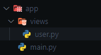

# Through Decorators

## Add Pages from Other Files

Use the `AddPagesy` class (Sub-Router) to organize pages in separate files and group them with a common URL prefix.

## `AddPagesy` Class (Sub-Routes) {#addpagesy-class}

```python
class AddPagesy:
    def __init__(
        self,
        route_prefix: str = "",
        middleware: Optional[List[Callable]] = None
    )
```

### Parameters

#### `route_prefix`

**Type**: `str` (optional)

URL prefix prepended to all page routes in this group.

**Example**: `route_prefix="/user"` converts `"/profile"` to `"/user/profile"`

#### `middleware`

???+ info "Available since version 0.3.0"

**Type**: `List[Callable]` (optional)

Middleware functions automatically applied to all pages in this group.

**Example**:

```python
# Define middleware
async def login_middleware(data: fs.Datasy):
    username = await data.page.client_storage.get_async("login")
    if username is None or username not in db:
        return data.redirect("/login")

# Create AddPagesy with middleware
users = fs.AddPagesy(
    route_prefix="/user",
    middleware=[login_middleware]  # Applied to all pages
)

# All pages inherit the middleware automatically
@users.page("/profile", title="Profile")
def user_page(data: fs.Datasy):
    return ft.View(controls=[ft.Text("Profile")])

@users.page("/settings", title="Settings")
def settings_page(data: fs.Datasy):
    return ft.View(controls=[ft.Text("Settings")])
```

### Methods

#### `page(route, **kwargs)`

Decorator to add a page to the group. Same parameters as `Pagesy` class. ([See documentation](../add-pages/using-functions.md#pagesy))

**Supports**: Sync and async functions

## Complete Example

### App Structure



**URLs created**: `/user/task`, `/user/information`

### Using Functions

```python title="user.py"
import flet_easy as fs
import flet as ft

# Create page group with URL prefix
users = fs.AddPagesy(route_prefix="/user")

@users.page("/task", title="Task")
def task_page(data: fs.Datasy):
    return ft.View(
        controls=[
            ft.Text("Task", size=24),
            ft.FilledButton(
                "Go to Information",
                on_click=data.go("/user/information"),
            ),
        ],
        vertical_alignment="center",
        horizontal_alignment="center",
    )

@users.page("/information", title="Information")
async def information_page(data: fs.Datasy):  # Async supported
    return ft.View(
        controls=[
            ft.Text("Information", size=24),
            ft.FilledButton(
                "Back to Task",
                on_click=data.go("/user/task"),
            ),
        ],
        vertical_alignment="center",
        horizontal_alignment="center",
    )
```

#### Demo

<video controls>
  <source src="../../../assets/guide/add-pages/Through-decorators-using_functions.webm" type="video/mp4" alt="Flet-Easy - Add Pages Through Decorators Using Functions">
</video>

### Using Classes

!!! warning "Available since version 0.2.4"

**Requirements**:

- Constructor must accept `data: fs.Datasy` parameter
- Must have a `build()` method that returns `ft.View` (can be async)
- No inheritance needed

**Benefits**: Code reusability through inheritance, better organization for complex pages.

```python title="user.py"
@users.page("/test", title="Test")
class TestPage:
    def __init__(self, data: fs.Datasy):
        self.data = data
        self.counter = 0

    def increment(self, e):
        self.counter += 1
        self.data.page.update()

    async def build(self):
        return ft.View(
            controls=[
                ft.Text("Test Page", size=24),
                ft.Text(f"Counter: {self.counter}"),
                ft.ElevatedButton("Increment", on_click=self.increment),
                ft.FilledButton(
                    "Back to Task",
                    on_click=self.data.go("/user/task"),
                ),
            ],
            vertical_alignment="center",
            horizontal_alignment="center",
        )
```

### Using Declarative Components (`@ft.component`)

!!! warning "Available since version 0.3.0"
    - flet >= 0.80.0 [GitHub](https://github.com/flet-dev/flet/releases/tag/v0.80.0)

You can now use Flet's declarative UI components (like `@ft.component`) natively as route handlers. Flet-Easy seamlessly delivers `Datasy`, your custom URL parameters, and integrates perfectly with `ft.use_state()` or other Flet hooks.

**Note on Cache**: The `cache` property works only in **imperative** mode and is currently not supported for pages using `@ft.component`.

#### Declarative Component Example

This example demonstrates how to build a full app with state management (`@dataclass`, `@ft.observable`), Flet hooks (`ft.use_state`), and different components linked with Flet-Easy routers (`AddPagesy` and `@app.page`).

```python title="main.py" hl_lines="11 26 28 55 66 95 105 108"
import asyncio
from dataclasses import dataclass

import flet as ft
import flet_easy as fs

app = fs.FletEasy()

# 1. State Management for the Counter
@dataclass
@ft.observable
class CounterState:
    count: int = 0

    def add(self):
        self.count += 1

    def remove(self):
        self.count -= 1

    def reset(self):
        self.count = 0


# 2. A Reusable Declarative Sub-Component (No Route)
@ft.component
def counter():
    state, _ = ft.use_state(CounterState())

    return ft.Column(
        controls=[
            ft.Text(value=f"{state.count}", size=30),
            ft.Row(
                controls=[
                    ft.Button("Add", on_click=state.add),
                    ft.Button("Remove", on_click=state.remove),
                    ft.Button("Reset", on_click=state.reset),
                ],
                alignment="center",
            ),
        ],
        alignment="center",
        horizontal_alignment="center",
    )


# 3. Simple Middleware Example
def middleware_home(data: fs.Datasy):
    data.page.show_dialog(
        ft.SnackBar(ft.Text(f"route: {data.route} - Hello from middleware!"))
    )


# 4. Declarative App Page with `@ft.component`
@ft.component
@app.page(route="/", title="Home", middleware=middleware_home)
def App(data: fs.Datasy):
    
    # You can navigate natively using context...
    async def go_test():
        await ft.context.page.push_route("/test")

    # ...or use the traditional fs.Datasy go() method.
    return ft.View(
        controls=[
            counter(),  # Insert the sub-component statefully
            ft.Button("Go test (Native Context)", on_click=go_test),
            ft.Button("Go progress-bar (Flet-Easy Data)", on_click=data.go("/add-pagesy/progress-bar")),
        ],
        vertical_alignment="center",
        horizontal_alignment="center",
    )


# 5. Standard Imperative Function Route
@app.page(route="/test", title="Test")
def test(data: fs.Datasy):
    return ft.View(
        controls=[
            ft.Text("Test Page", size=30),
            ft.Button("Go Back", on_click=data.go("/")),
        ],
        vertical_alignment="center",
        horizontal_alignment="center",
    )


# 6. Another AddPagesy Group using Declarative Components
app2 = fs.AddPagesy(
    route_prefix="/add-pagesy",
    middleware=middleware_home,
)

@dataclass
@ft.observable
class AppState:
    counter: float

    async def start_counter(self):
        self.counter = 0
        for _ in range(0, 10):
            self.counter += 0.1
            await asyncio.sleep(0.5)

@ft.component
@app2.page(route="/progress-bar", title="Progress Bar")
def progress_bar(data: fs.Datasy):
    state, _ = ft.use_state(AppState(counter=0))

    async def go_back():
        await ft.context.page.push_route("/")

    return ft.View(
        controls=[
            ft.Text("Async Progress Bar Demo", size=24),
            ft.ProgressBar(state.counter, width=300),
            ft.Button("Run Progress!", on_click=state.start_counter),
            ft.Button("Go Back", on_click=go_back),
        ],
        vertical_alignment="center",
        horizontal_alignment="center",
    )

app.add_pages([app2])
app.run()
```

#### Key Takeaways

1. **State Independence**: Notice how the `counter()` component maintains its own isolated state using `ft.use_state()` while being inside the larger `App` page view component.
2. **Context vs `Datasy` Navigation**: Flet-Easy ensures that native `ft.context.page.push_route()` commands and `data.go()` calls stay perfectly synchronized and both are valid ways to navigate.
3. **Combined Architecture**: As shown in the `/test` route, you are fully supported to mix standard imperative functions alongside declarative component classes within your Flet-Easy application.

### Demo

<video controls>
  <source src="../../../assets/guide/add-pages/declarative-component.webm" type="video/webm" alt="Flet-Easy - Add Pages Through Decorators Using Declarative Components">
</video>

### Adding Pages to Main App

Import and register page groups using `add_pages()`.

```python title="main.py"
import flet_easy as fs
from views.user import users

app = fs.FletEasy(route_init="/user/task")

# Add single group or list of groups
app.add_pages(users)  # or app.add_pages([users, admin, products])

app.run()
```

---

## Alternative: Without `AddPagesy`

!!! warning "Available since version 0.2.7"

Use `@fs.page()` decorator directly for standalone pages without route prefix or shared middleware.

!!! note "Important"
    Set `path_views` parameter for automatic page discovery.

**Main file**:

```python title="main.py"
import flet_easy as fs
from pathlib import Path

app = fs.FletEasy(
    route_init="/test",
    path_views=Path(__file__).parent / "views",  # Required
)

app.run()
```

**Page file** (in `views/` folder):

```python title="views/user.py"
import flet_easy as fs
import flet as ft

@fs.page(route="/test", title="Test")
def page_test(data: fs.Datasy):
    return ft.View(
        controls=[ft.Text("Test Page", size=24)],
        vertical_alignment="center",
        horizontal_alignment="center",
    )

@fs.page(route="/about", title="About")
def about_page(data: fs.Datasy):
    return ft.View(
        controls=[ft.Text("About Page", size=24)],
        vertical_alignment="center",
        horizontal_alignment="center",
    )
```

---

## Summary

| Feature               | `AddPagesy`   | `@fs.page()`        |
|-----------------------|---------------|---------------------|
| **Route Prefix**      | ✅ Yes        | ❌ No               |
| **Shared Middleware** | ✅ Yes        | ❌ No               |
| **Best For**          | Grouped pages | Standalone pages    |

**Use `AddPagesy`** when you need URL prefixes or shared middleware for multiple related pages.

**Use `@fs.page()`** for simple standalone pages without grouping.
