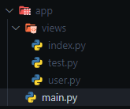

# Using Functions

## Adding pages without using decorators

You can register routes in your main application without using decorators by using the `add_routes` method from the `FletEasy` class.

!!! note "Supports async functions"

## App structure



### **Example: Defining a Page Function**

```python title="views/index.py" hl_lines="5"
import flet_easy as fs
import flet as ft

# 1. Define the page function receiving 'data: fs.Datasy'
def page_index(data: fs.Datasy):
    return ft.View(
        controls=[
            ft.Text('Index Page'),
        ],
        vertical_alignment="center",
        horizontal_alignment="center"
    )
```

### **Example: Defining a Page Class**

!!! warning "Available since version 0.2.4"

Create new pages by using classes. You don't need to inherit from any specific class.

- **Constructor**: Must accept `data: fs.Datasy` as a mandatory parameter. Any dynamic URL parameters should also be defined here.
- **build() method**: A mandatory method that returns an `ft.View` (can be `async`).

```python title="views/test.py" hl_lines="4 10"
import flet_easy as fs
import flet as ft

class PageTest:
    def __init__(self, data: fs.Datasy, id: int, name: str):
        self.data = data
        self.id = id
        self.name = name
    
    def build(self):
        return ft.View(
            controls=[
                ft.Text(f'User ID: {self.id}'),
                ft.Text(f'Name: {self.name}'),
                ft.FilledButton(
                    "Go to Index",
                    on_click=self.data.go("/index"),
                ),
            ],
            vertical_alignment="center",
            horizontal_alignment="center"
        )
```

### Add routes

We import the functions or classes from the `views` folder, then we use the [`add_routes`](../../started/how-to-use.md#methods) method of the [FletEasy](../../started/how-to-use.md#fleteasy) instance, in which we will add a list of [`Pagesy`](#pagesy) classes where we will configure the routes and the functions or classes to be used in addition to others.

```python title="main.py"
# Import functions from a `views` folder
from views.user import users
from views.index import page_index
from views.test import PageTest
import flet_easy as fs

app = fs.FletEasy()

# Register routes using Pagesy objects
app.add_routes(add_views=[
    fs.Pagesy('/index', page_index, title='Home'),
    fs.Pagesy(
        '/test/{id:int}/user/{name:str}',
        PageTest,
        title='User Profile',
        protected_route=True
    ),
])

if __name__ == "__main__":
    app.run()
```

## Pagesy

📑 The class `Pagesy`, it requires the following parameters:

- `route`: text string of the url, for example(`'/index'`).
- `view`: Stores the page function.
- `title` : Define the title of the page.
- `clear`: Removes the pages from the `page.views` list of flet. (optional)
- `index`: Define the index of the page, use in controls like `ft.NavigationBar` and `ft.CupertinoNavigationBar`. (optional)
- `cache`: Boolean that preserves page state when navigating. Controls retain their values instead of resetting. Works in **imperative** mode, but not in **declarative** (`@ft.component`). (optional)
- `share_data` : It is a boolean value, which is useful if you want to share data between pages, in a morerestricted way. (optional) [[`See more`](../../advanced/data-sharing-between-pages.md)]
- `protected_route`: Protects the route of the page, according to the configuration of the `login` decoratorof the `FletEasy` class. (optional) [[`See more`](../../advanced/route-protection.md)]
- `custom_params`: To add validation of parameters in the custom url using a dictionary, where the key is the nameof the parameter validation and the value is the custom function that must report a boolean value. [[`See more`](../routing/dynamic-routes.md#custom-validation)]
- `middleware` : It acts as an intermediary between different software components, intercepting andprocessing requests and responses. They allow adding functionalities to an application in a flexible andmodular way. (optional) [[`See more`](../../advanced/middleware.md#for-each-page)]
