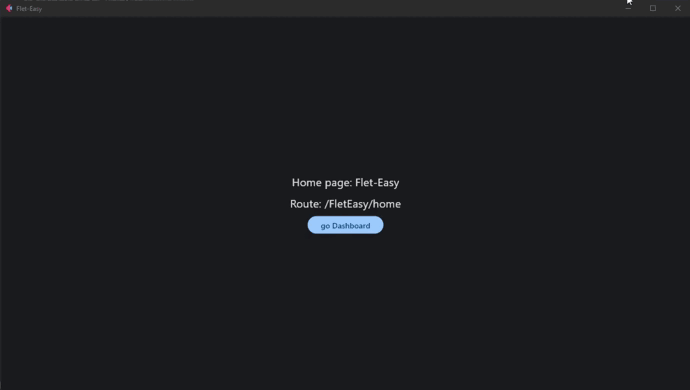

# How to use

`Flet-Easy` presents a structure according to how the user wants to adapt it, since it allows to have several files and connect them to a main file.

* To use `Flet-easy`, first we have to use the `FletEasy` class and create an object where to make the app configurations.

## FletEasy

We create the app object, in which you can configure:

* `route_prefix` : The route that is different from `/`.
* `route_init` : The initial route to initialize the app, by default is `/`.
* `route_login` : The route that will be redirected when the app has route protectionconfigured.
* `on_Keyboard` : Enables the on_Keyboard event, by default it is disabled (False). [[`See more`]](/flet-easy/0.1.0/events/keyboard-event/)
* `on_resize` : Triggers the on_resize event, by default it is disabled (False). [[`See more`]](/flet-easy/0.1.0/events/on-resize/)

### 📷 **Demo**


  
### **Example**

```Python
import flet_easy as fs

app = fs.FletEasy(
    route_prefix='/FletEasy',
    route_init='/FletEasy/home',
)
```

### Methods

* `run()` : Execute the app. [[`See more`]](/flet-easy/0.1.0/run-the-app/#run)
* `run_async()` : Execute the app, soporta async. [[`See more`]](/flet-easy/0.1.0/run-the-app/#run_async)
* `fastapi()` : Returns the `Flet page` object. [[`See more`]](/flet-easy/0.1.0/run-the-app/use-with-fastapi/)
* `add_pages()` : Add pages from other archives. In the list you enter objects of class [AddPagesy](/flet-easy/0.1.0/add-pages/through-decorators/#addpagesy) from other .py files. [[`See more`]](/flet-easy/0.1.0/add-pages/through-decorators/#adding-pages)
* `add_routes()` : Add routes without the use of decorators. [[`See more`]](/flet-easy/0.1.0/add-pages/by-means-of-functions/#add-routes)

### Decorators

* `page()` : Decorator to add a new page to the app. This decorator method acts similarly to the `Pagesy` class and contains the same required parameters. [[`See more`]](/flet-easy/0.1.0/how-to-use/#decorator-page)
* `config` : Decorator to add a custom configuration to the app. [[`See more`]](/flet-easy/0.1.0/customized-app/general-settings/)
* `login` : Decorator to add a login configuration to the app (protected_route). [[`See more`]](/flet-easy/0.1.0/customized-app/route-protection/)
* `page_404()` : Decorator to add a new custom page when not finding a route in the app. [[`See more`]](/flet-easy/0.1.0/customized-app/page-404)
* `view` : Decorator to add custom controls to the application, the decorator function will return the `Viewsy`. Which will be obtained in functions with `data:fs.Datasy` parameter and can be added to the page view decorated with `data.view`. [[`See more`]](/flet-easy/0.1.0/customized-app/control-view-configuration/)
* `config_event_handler`: Decorator to add [flet page event](https://flet.dev/docs/controls/page/#events) configurations. [[`See more`]](/flet-easy/0.1.0/customized-app/events/)

---

## How to create a new page?

To create a new page you use a decorator that provides the object created by the `FletEasy` class, which is `page` that allows you to enter certain parameters.

### Decorator **`page`**

To add pages, the following parameters are required:

!!! warning "In version 0.1.0 `protected_route` is `proctect_route`"

* `route`: text string of the url, for example(`'/FletEasy'`).
* `page_clear`: Removes the pages from the `page.views` list of flet (optional).
* `protected_route`: Protects the page path, according to the `login` decorator configurationof the `FletEasy` class (optional). [[`See more`]](/flet-easy/0.1.0/customized-app/route-protection/)
* `custom_params`: To add parameter validation in the custom URL using a dict, where key is the name of the parameter validation and value is the custom function that should return a boolean value.

### **Example**

```Python hl_lines="4 9 29"
import flet_easy as fs
import flet as ft

app = fs.FletEasy(
    route_prefix='/FletEasy',
    route_init='/FletEasy/home',
)

@app.page(route="/home")
def home_page(data: fs.Datasy):
    page = data.page
    page.title = "Flet-Easy"

    return ft.View(
        controls=[
            ft.Text(f"Home page: {page.title}"),
            ft.Text(f"Route: {page.route}"),
            ft.FilledButton(
                "go Dashboard",
                key=f"{data.route_prefix}/dashboard",
                on_click=data.go
                ),
        ],
        vertical_alignment="center",
        horizontal_alignment="center",
    )


@app.page(route="/dashboard")
def dashboard_page(data: fs.Datasy):
    page = data.page
    page.title = "Dashboard"

    return ft.View(
        controls=[
            ft.Text(f"Home page: {page.title}"),
            ft.Text(f"Route: {page.route}"),
            ft.FilledButton(
                "go Home",
                on_click=lambda e: data.go(data.route_init)
                ),
        ],
        vertical_alignment="center",
        horizontal_alignment="center",
    )

app.run()
```

---

## Datasy (data)

The decorated function will always receive a parameter which is `data` (can be any name), which will make an object of type `Datasy` of `Flet-Easy`.

This class has the following attributes, in order to access its data:

* `page` : We get the values of the page provided by [`Flet`](https://flet.dev/docs/controls/page) .
* `url_params` : We obtain a dictionary with the values passed through the url.
* `view` : Get a `View` object from [`Flet`](https://flet.dev/docs/controls/view), previouslyconfigured with the [`View`](/flet-easy/0.1.0/customized-app/control-view-configuration/) decorator of `Flet-Easy`.
* `route_prefix` : Value entered in the `FletEasy` class parameters to create the app object.
* `route_init` : Value entered in the `FletEasy` class parameters to create the app object.
* `route_login` : Value entered in the `FletEasy` class parameters to create the app object.

---
!!! Warning "`share` Available from version 0.1.1"

* `share` : It is used to be able to store and to obtain values in the client session, theutility is to be able to have greater control in the pages in which it is wanted to share, forit the parameter `share_data` of the `page` decorator must be used. The methods to use aresimilar [`page.session`](https://flet.dev/docs/guides/python/session-storage). [[`See more`]](/flet-easy/0.1.0/data-sharing-between-pages/)
Besides that you get some extra methods:
  * `contains` : Returns a boolean, it is useful to know if there is shared data.
  * `get_values` : Get a list of all shared values.
  * `get_all` : Get the dictionary of all shared values.

---

* `on_keyboard_event` : get event values to use in the page. [[`See more`]](/flet-easy/0.1.0/events/keyboard-event/)
* `on_resize` : get event values to use in the page. [[`See more`]](/flet-easy/0.1.0/events/on-resize/)

### Methods

* `logaut() / logaut_async()` : method to close sessions of all sections in the browser (client storage), requires as parameter the key or the control (the key parameter of the control must have the value to delete), this is to avoid creating an extra function. [[`See more`]](/flet-easy/0.1.0/customized-app/route-protection/#logout)
* `update_login() / update_login_async()` : Method to create sessions of all sections in the browser (client storage), requires as parameters the key and the value, the same used in the `page.client_storage.set` method. [[`See more`]](/flet-easy/0.1.0/customized-app/route-protection/#login)
* `go() / go_async()` : Method to change the application path. (optional)

---

!!! Note "logaut and login"
    Compatible with android, ios, windows and web.

## 🎬 **Demo**


