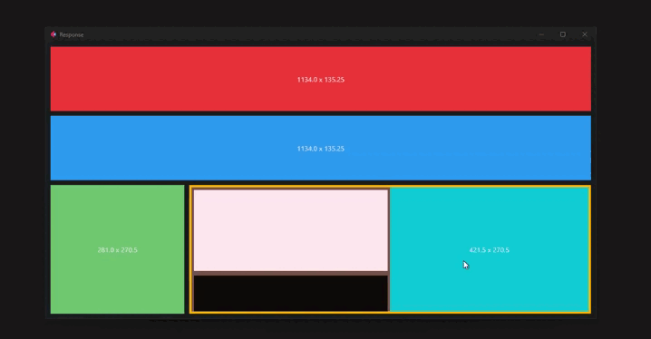

# ResponsiveControlsy

Allows the controls to adapt to the size of the app (responsive). It is suitable for use in applications, in web it is not recommended.

!!! note
    Avoid activating scroll outside ResponseControl.

This class contains the following parameters:

* `content: Control` : Contains a control of flet.
* `expand: int` : To specify the space that will contain the content controller in the app, 1 equals the whole app.
* `resize_interval: int` : To specify the response time (optional).
* `on_resize: callable` : Custom function to be executed when the app is resized (optional).
* `show_resize: bool` : To observe the size of the controller (width x * height). is disabled when sending an on_resize function. (optional)
* `show_resize_terminal: bool` : To see the size of the controller (width x height) in the terminal. (optional)

## **Example**

```python
import flet_easy as fs

fs.ResponsiveControlsy(
    content=ft.Container(
        content=ft.Text("on_resize"),
        bgcolor=ft.colors.RED,
        alignment=ft.alignment.center,
        height=100
    ),
    expand=1,
    show_resize=True
)
```

## **Advanced use**

```python hl_lines="80 93 103 112"
import flet as ft
import flet_easy as fs
from flet.canvas import CanvasResizeEvent

app = fs.FletEasy(
    route_init="/response"
)

class ResponseTest(ft.UserControl):
    def __init__(self):
        super().__init__()

    def build(self):
        return ft.Row(
            controls=[
                fs.ResponsiveControlsy(
                    ft.Container(
                        content=ft.Text("W x H"),
                        bgcolor=ft.colors.GREEN_400,
                        alignment=ft.alignment.center,
                    ),
                    expand=1,
                    show_resize=True,
                ),
                fs.ResponsiveControlsy(
                    ft.Container(
                        content=ft.Row(
                            controls=[
                                fs.ResponsiveControlsy(
                                    content=ft.Container(
                                        content=ft.Column(
                                            controls=[
                                                ft.Container(
                                                    bgcolor=ft.colors.DEEP_ORANGE_50,
                                                    height=170,
                                                    margin=5,
                                                ),
                                                ft.Container(
                                                    bgcolor=ft.colors.BLACK87,
                                                    height=170,
                                                    margin=5
                                                ),
                                            ],
                                            scroll=ft.ScrollMode.HIDDEN,
                                            spacing=0,
                                        ),
                                        bgcolor=ft.colors.BROWN_500,
                                        expand=True,
                                        margin=ft.Margin(5, 5, 0, 5),
                                    ),
                                    expand=1,
                                    show_resize=True,
                                ),
                                fs.ResponsiveControlsy(
                                    content=ft.Container(
                                        content=ft.Text(
                                            "ok",
                                        ),
                                        bgcolor=ft.colors.CYAN_500,
                                        alignment=ft.alignment.center,
                                        margin=ft.Margin(0, 5, 5, 5),
                                    ),
                                    expand=1,
                                    show_resize=True,
                                ),
                            ],
                            expand=1,
                            spacing=0,
                        ),
                        bgcolor=ft.colors.AMBER_600,
                        alignment=ft.alignment.center,
                    ),
                    show_resize=True,
                    expand=3,
                ),
            ],
            expand=2,
        )

@app.page(route="/response")
def response_page(data: fs.Datasy):
    page = data.page
    page.title = "Response"

    def handle_resize(e: CanvasResizeEvent):
        c = e.control.content
        t = c.content
        t.value = f"{e.width} x {e.height}"
        page.update()

    return ft.View(
        controls=[
            fs.ResponsiveControlsy(
                content=ft.Container(
                    content=ft.Text("W x H"),
                    bgcolor=ft.colors.RED,
                    alignment=ft.alignment.center,
                    height=100,
                ),
                expand=1,
                show_resize=True,
            ),
            fs.ResponsiveControlsy(
                ft.Container(
                    content=ft.Text("W x H"),
                    bgcolor=ft.colors.BLUE,
                    alignment=ft.alignment.center
                ),
                on_resize=handle_resize,
                expand=1,
            ),
            fs.ResponsiveControlsy(
                content=ResponseTest(),
                expand=2
                )
        ],
    )

app.run()
```

## 🎬 **Demo**


