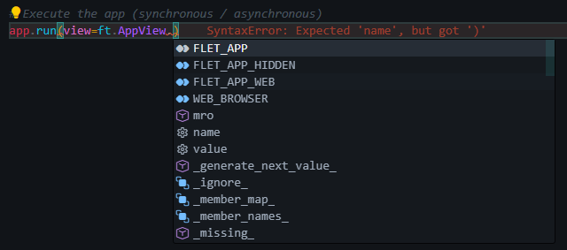

# Run the app

To run the application we use an object method already instantiated by [`FletEasy`](/flet-easy/0.2.0/how-to-use/#fleteasy) (you can customize the parameters of method according to your needs :) .

## Methods

### run

")

### Use with fastapi

!!! warning "Available from version 0.2.8"
    Instead of using `app.run(fastapi)`:
    ```python
    app.get_app()
    ```

To get the main of the app and be able to add Fastapi to it.

")

### Export asgi app

")

---
!!! warning "Available from version 0.2.8"

### Use `Flet-Easy` in an existing app

Now `Flet-Easy` can be used within the main function of the app, this is a very favorable characteristic since it can be able to use **Flet-Easy** in an application already exists or adapt it according to code writing preferences.

!!! note "New method to use `app.start(page)`"
    * **Note:** You can use all existing features in **Flet-Easy**.

```python title="main.py" hl_lines="35"
import flet as ft
import flet_easy as fs

def index_page(data: fs.Datasy):
    return ft.View(
        controls=[
            ft.Text("Home - app", size=90),
            ft.ElevatedButton("Go to About", on_click=data.go("/about")),
        ],
        vertical_alignment="center",
        horizontal_alignment="center",
    )

def about_page(data: fs.Datasy):
    return ft.View(
        controls=[
            ft.Text("About - app", size=90),
            ft.ElevatedButton("Go to Home", on_click=data.go("/")),
        ],
        vertical_alignment="center",
        horizontal_alignment="center",
    )


def main(page: ft.Page):
    page.title = "Flet-Easy - app"

    app = fs.FletEasy()
    app.add_routes(
        add_views=[
            fs.Pagesy("/", index_page, title="Home"),
            fs.Pagesy("/about", about_page, title="About"),
        ]
    )
    app.start(page)

ft.app(target=main)
```

### Get the app created by `Flet-Easy`

Although this function already exists through the use of the parameter `fastapi=True` of the `run()` of Flet-Easy and is usually very confined, so the best way to understand the code and that has better legitivity would be better to use the new method `get_app()` of Flet-Easy.

!!! note "New method to use `app.get_app()`"
    * **Note:** You can use all existing features in **Flet-Easy**.

```python title="main.py" hl_lines="29"
import flet as ft
import flet_easy as fs

app = fs.FletEasy()

@fs.page("/", title="Home")ssss
def index_page(data: fs.Datasy):
    return ft.View(
        controls=[
            ft.Text("Home - app", size=90),
            ft.ElevatedButton("Go to About", on_click=data.go("/about")),
        ],
        vertical_alignment="center",
        horizontal_alignment="center",
    )

@fs.page("/about", title="About")
def about_page(data: fs.Datasy):
    return ft.View(
        controls=[
            ft.Text("About - app", size=90),
            ft.ElevatedButton("Go to Home", on_click=data.go("/")),
        ],
        vertical_alignment="center",
        horizontal_alignment="center",
    )

## get app and run it
ft.app(target=app.get_app())
```

---

## customize as it is executed



## Possible errors

### build web

!!! warning "If there are problems in `build web`"
    Use:
    ```python title="main.py v0.2.7"
    import flet as ft

    ft.app(app.run(fastapi=True))
    ```

    ```python title="main.py v0.2.8"
    import flet as ft

    ft.app(app.get_app())
    ```

### build windows

!!! warning "If there are problems in `build windows`"
    remove `print()` from Python if used in ['add_middleware'](/flet-easy/0.2.0/middleware/#method-and-attribute-to-use-see-more) functions.
