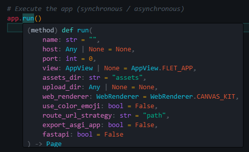
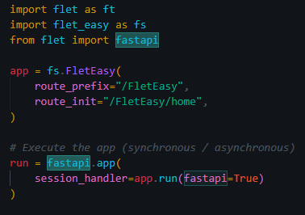
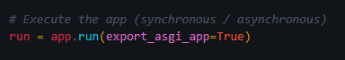

# Run the app
To run the application we use an object method already instantiated by Flet-Easy (you can customize the parameters of your method according to your needs):

## 📷 **Demo**


## customize as it is executed


## Use with fastapi


## Export asgi app


???+ info "If you have any problem in `build Web`"
     Use:
     ```python
     ft.app(target=app.run(fastapi=true))
     ```