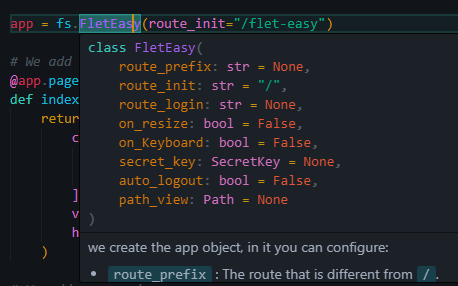

# How to use

`Flet-Easy` presents a structure according to how the user wants to adapt it, since it allows to have several files and connect them to a main file.

* To use `Flet-easy`, first we have to use the `FletEasy` class and create an object where to make the app configurations.

## FletEasy

We create the app object, in which you can configure:

* `route_prefix` : The route that is different from `/`.
* `route_init` : The initial route to initialize the app, by default is `/`.
* `route_login` : The route that will be redirected when the app has route protection configured.
* `on_keyboard` : Enables the on_keyboard event, by default it is disabled (False). [[`See more`](../advanced/events/keyboard-event.md)]
* `on_resize` : Triggers the on_resize event, by default it is disabled (False). [[`See more`](../advanced/events/on-resize.md)]
* `secret_key` : Used with `SecretKey` class of Flet-Easy, to configure JWT or client storage. [[`See more`](../advanced/basic-jwt.md)]
* `path_views` : Configuration of the folder where are the .py files of the pages, you use the `Path` class to configure it. [[`See more`](../guide/add-pages/in-automatic.md)]

### 📷 **Demo**


  
### **Example**

```Python
import flet_easy as fs

app = fs.FletEasy(
    route_prefix='/FletEasy',
    route_init='/FletEasy/home',
)
```

### Methods

* `run()` : Execute the app. Supports async, fastapi and export_asgi_app. [[`See more`](run-the-app.md)]
* `add_middleware()` : Requires a list of functions or classes. [[`See more`](../advanced/middleware.md)]
* `add_pages()` : Add pages from other files. In the list you enter objects of class [AddPagesy](../guide/add-pages/through-decorators.md#addpagesy-class). [[`See more`](../guide/add-pages/through-decorators.md#adding-pages-to-main-app)]
* `add_routes()` : Add routes without the use of decorators. [[`See more`](../guide/add-pages/using-functions.md#add-routes)]

### Decorators

* `page()` : Decorator to add a new page to the app. This decorator method acts similarly to the `Pagesy` class and contains the same required parameters. [[`See more`]](how-to-use.md#decorator-page)
* `config` : Decorator to add a custom configuration to the app. [[`See more`]](../advanced/configuration/general.md)
* `login` : Decorator to add a login configuration to the app (protected_route). [[`See more`]](../advanced/route-protection.md)
* `page_404()` : Decorator to add a new custom page when not finding a route in the app. [[`See more`]](../advanced/configuration/page-404.md)
* `view` : Decorator to add custom controls to the application, the decorator function will return the `Viewsy`. Which will be obtained in functions with `data:fs.Datasy` parameter and can be added to the page view decorated with `data.view`. [[`See more`]](../advanced/configuration/control-view.md)
* `config_event_handler`: Decorator to add [flet page event](https://flet.dev/docs/controls/page/#events) configurations. [[`See more`]](../advanced/events/handle.md)

---

## How to create a new page?

To create a new page you use a decorator that provides the object created by the `FletEasy` class, which is `page` that allows you to enter certain parameters.

### Decorator **`page`**

???+ warning "Available since version 0.3.0"

    * `index` : Define the index of the page, use in controls like `ft.NavigationBar` and `ft.CupertinoNavigationBar`.
    * `cache` : Boolean that preserves page state when navigating. Controls retain their values instead of resetting. Works in **imperative** mode, but not in **declarative** (`@ft.component`). (Optional)

To add pages, the following parameters are required:

* `route`: text string of the url, for example(`'/FletEasy'`).
* `title`: Defines the title of the page.
* `page_clear`: Removes the pages from the `page.views` list of flet (optional).
* `share_data` : Is a boolean value, useful if you want to share data between pages, in a more restricted way (optional). [[`See more`](../advanced/data-sharing-between-pages.md)]
* `protected_route`: Protects the page path, according to the `login` decorator configuration of the `FletEasy` class (optional). [[`See more`](../advanced/route-protection.md)]
* `custom_params`: To add parameter validation in the custom url using a dictionary. [[`See more`](../guide/routing/dynamic-routes.md#custom-validation)]
* `middleware` : Acts as an intermediary between different software components. It can be used in the app in general, as well as in each of the pages (optional). [[`See more`](../advanced/middleware.md#for-each-page)]
* `index` : Define the index of the page, use in controls like `ft.NavigationBar` and `ft.CupertinoNavigationBar`.
* `cache`: Boolean that preserves page state when navigating. Controls retain their values instead of resetting. Works in **imperative** mode, but not in **declarative** (`@ft.component`). (Optional)

### **Example**

```Python hl_lines="4 9 27 44"
import flet_easy as fs
import flet as ft

app = fs.FletEasy(
    route_prefix='/FletEasy',
    route_init='/FletEasy/home',
)

@app.page(route="/home", title="Flet-Easy")
def home_page(data: fs.Datasy):
    page = data.page

    return ft.View(
        controls=[
            ft.Text(f"Home page: {page.title}"),
            ft.Text(f"Route: {page.route}"),
            ft.FilledButton(
                "go Home",
                on_click=data.go(f"{data.route_prefix}/dashboard")
                ),
        ],
        vertical_alignment="center",
        horizontal_alignment="center",
    )


@app.page(route="/dashboard", title="Dashboard")
def dashboard_page(data: fs.Datasy):
    page = data.page

    return ft.View(
        controls=[
            ft.Text(f"Home page: {page.title}"),
            ft.Text(f"Route: {page.route}"),
            ft.FilledButton(
                "go Home",
                on_click=data.go(data.route_init)
                ),
        ],
        vertical_alignment="center",
        horizontal_alignment="center",
    )

app.run()
```

---

## Datasy (data)

???+ warning "Available since version 0.2.4"

    * `history_routes` : Get the history of the routes.
    * `go_back()` : Method to go back to the previous route.

???+ warning "Available since version 0.3.0"

    * `page_reload()` : Use this method to reload the page, restores the default values of the page.
    * `dynamic_control()` : Adds dynamic control to the page, allowing real-time updates when caching is enabled on the page.
    * `go_navigation_bar()` : Handles navigation bar changes. Use this method in the on_change event of 'ft.NavigationBar' or 'ft.CupertinoNavigationBar' controls.

The decorated function will always receive a parameter which is `data` (can be any name), which will make an object of type `Datasy` of `Flet-Easy`.

This class has the following attributes, in order to access its data:

* `page` : We get the values of the page provided by [`Flet`](https://flet.dev/docs/controls/page) .
* `url_params` : We obtain a dictionary with the values passed through the url.
* `view` : Get a `Viewsy` object, previously configured with the [`view`](#decorators) decorator of `Flet-Easy`.
* `route_prefix` : Value entered in the `FletEasy` class parameters to create the app object.
* `route_init` : Value entered in the `FletEasy` class parameters to create the app object.
* `route_login` : Value entered in the `FletEasy` class parameters to create the app object.

---

* `share` : It is used to be able to store and to obtain values in the client session. [[`See more`](../advanced/data-sharing-between-pages.md)]
Besides that you get some extra methods:
  * `contains` : Returns a boolean, it is useful to know if there is shared data.
  * `get_values` : Get a list of all shared values.
  * `get_all` : Get the dictionary of all shared values.

---

* `on_keyboard_event` : get event values to use in the page. [[`See more`](../advanced/events/keyboard-event.md)]
* `on_resize` : get event values to use in the page. [[`See more`](../advanced/events/on-resize.md)]
* `route` : route provided by the route event, it is useful when using middlewares to check if the route is accessible.
* `history_routes` : Get the history of the routes.

### Methods

* `logout()` : method to close sessions. [[`See more`](../advanced/route-protection.md#logout)]
* `login()` : Method to create sessions. [[`See more`](../advanced/route-protection.md#login)]
* `go()` : Method to change the application path (recommended to use this instead of `page.go` to avoid path errors).
* `redirect()` : To redirect to a specific route directly. It can be used in middlewares or inside `page` functions.
* `go_back()` : Method to go back to the previous route.
* `page_reload()` : Use this method to reload the page, restores the default values of the page.
* `dynamic_control()` : Adds dynamic control to the page, allowing real-time updates when caching is enabled on the page.
* `go_navigation_bar()` : Handles navigation bar changes. Use this method in the on_change event of 'ft.NavigationBar' or 'ft.CupertinoNavigationBar' controls.

---

!!! tip
    Now `page.go()` and `data.go()` work similarly to go to a page (`View`), the only difference is that `data.go()` checks for url redirects when using `data.redirect()`.

!!! Note "logaut and login"
    Compatible with android, ios, windows and web.

### 🎬 Demo

<video controls>
  <source src="../../assets/started/how-to-use.webm" type="video/webm" alt="How to use Flet-Easy">
</video>
