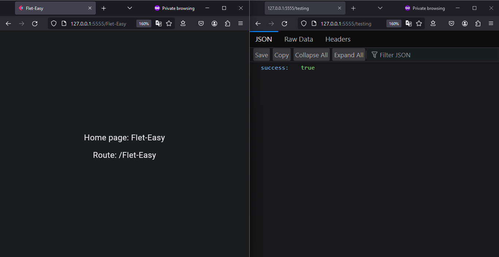

# Working with other apps

## Working with other apps and creating apis

To be able to make our main app work with other apps, besides being able to create apis from the same url path with the same host and port. First we must obtain the main of the app to be able to mount it in another app. For it we are going to use the [`run`](/flet-easy/0.2.0/run-the-app/#use-with-fastapi) method with its `fastapi=True` parameter.

!!! note "More information"
    * [Here](https://flet.dev/docs/guides/python/deploying-web-app/running-flet-with-fastapi#hosting-multiple-flet-apps-under-the-same-domain)

### **Example**

```python title="main.py" hl_lines="3 23 26 31"
import flet as ft
import flet_easy as fs
from flet import fastapi

app = fs.FletEasy(
    route_init="/Flet-Easy",
)

@app.page(route="/Flet-Easy", title="Flet-Easy")
def home_page(data: fs.Datasy):
    page = data.page

    return ft.View(
        controls=[
            ft.Text(f"Home page: {page.title}"),
            ft.Text(f"Route: {page.route}"),
        ],
        vertical_alignment="center",
        horizontal_alignment="center",
    )

# We create an app in FastApi
app_main = fastapi.FastAPI()

# Creating a basic test api.
@app_main.get("/testing")
def test_api():
    return {"success": True}

# We add the `flet` app to `fastapi`.
app_main.mount("/", fastapi.app(app.run(fastapi=True)))

```

#### Run the app

```bash
uvicorn main:app_main
```

### 📷 **Demo**


